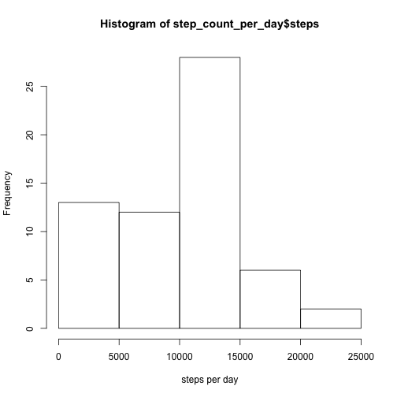
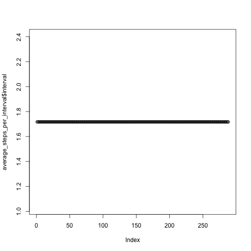

## Lets start with reading and processing the data

We will use a simple read.csv.


```r
device_readings <- read.csv(file = "activity.csv", header = T)
```

## What is mean total number of steps taken per day?

First we will calculate the number of steps taken each day.

```r
unique_days <- unique(device_readings$date)
number_of_days <- length(unique_days)
step_count_per_day <- data.frame(matrix(ncol = 2, nrow = number_of_days))
colnames(step_count_per_day) <- c("date", "steps")
step_count_per_day$date = as.Date(step_count_per_day$date, origin = "1970-01-01" )


for (i in seq_along(unique_days)) {
        device_reading_per_day <- subset(device_readings, date == unique_days[i])
        step_count_per_day$steps[i] <- sum(device_reading_per_day$steps, na.rm = TRUE)
        step_count_per_day$date[i] <- unique_days[i]
}
```

Now we generate an histogram of the number of steps per day


```r
hist(step_count_per_day$steps, xlab= "steps per day")
```

 

Now we will calculate and report the mean and the median values of the number of steps taken by day


```r
mean_steps <- mean(step_count_per_day$steps)
paste("The mean value is", mean_steps, sep = " ")
```

[1] "The mean value is 9354.22950819672"

```r
median_steps <- median(step_count_per_day$steps)
paste("The median value is", median_steps, sep = " ")
```

[1] "The median value is 10395"
## What is the average daily activity pattern?

Make a time series plot (i.e. type = "l") of the 5-minute interval (x-axis) and the average number of steps taken, averaged across all days (y-axis)

The first step is to create a table  that contains the average number of steps across the days for each of unique intervals of 5 minutes. 


```r
unique_intervals <- unique(device_readings$interval)
number_of_intervals <- length(unique_intervals)
average_steps_per_interval <- data.frame(matrix(ncol = 2, nrow = number_of_intervals))
colnames(average_steps_per_interval) <- c("intervals", "average steps")

for (i in seq_along(unique_intervals)) {
        current_interval <- unique_intervals[i]
        reading_per_interval <- subset(device_readings, interval == current_interval)
        average_steps_per_interval[i] <- mean(reading_per_interval$steps, na.rm = TRUE)
        
}

print (average_steps_per_interval)
```

```
##     intervals average steps        V3        V4        V5      V6
## 1    1.716981     0.3396226 0.1320755 0.1509434 0.0754717 2.09434
## 2    1.716981     0.3396226 0.1320755 0.1509434 0.0754717 2.09434
## 3    1.716981     0.3396226 0.1320755 0.1509434 0.0754717 2.09434
## 4    1.716981     0.3396226 0.1320755 0.1509434 0.0754717 2.09434
## 5    1.716981     0.3396226 0.1320755 0.1509434 0.0754717 2.09434
## 6    1.716981     0.3396226 0.1320755 0.1509434 0.0754717 2.09434
## 7    1.716981     0.3396226 0.1320755 0.1509434 0.0754717 2.09434
## 8    1.716981     0.3396226 0.1320755 0.1509434 0.0754717 2.09434
## 9    1.716981     0.3396226 0.1320755 0.1509434 0.0754717 2.09434
## 10   1.716981     0.3396226 0.1320755 0.1509434 0.0754717 2.09434
## 11   1.716981     0.3396226 0.1320755 0.1509434 0.0754717 2.09434
## 12   1.716981     0.3396226 0.1320755 0.1509434 0.0754717 2.09434
## 13   1.716981     0.3396226 0.1320755 0.1509434 0.0754717 2.09434
## 14   1.716981     0.3396226 0.1320755 0.1509434 0.0754717 2.09434
## 15   1.716981     0.3396226 0.1320755 0.1509434 0.0754717 2.09434
## 16   1.716981     0.3396226 0.1320755 0.1509434 0.0754717 2.09434
## 17   1.716981     0.3396226 0.1320755 0.1509434 0.0754717 2.09434
## 18   1.716981     0.3396226 0.1320755 0.1509434 0.0754717 2.09434
## 19   1.716981     0.3396226 0.1320755 0.1509434 0.0754717 2.09434
## 20   1.716981     0.3396226 0.1320755 0.1509434 0.0754717 2.09434
## 21   1.716981     0.3396226 0.1320755 0.1509434 0.0754717 2.09434
## 22   1.716981     0.3396226 0.1320755 0.1509434 0.0754717 2.09434
## 23   1.716981     0.3396226 0.1320755 0.1509434 0.0754717 2.09434
## 24   1.716981     0.3396226 0.1320755 0.1509434 0.0754717 2.09434
## 25   1.716981     0.3396226 0.1320755 0.1509434 0.0754717 2.09434
## 26   1.716981     0.3396226 0.1320755 0.1509434 0.0754717 2.09434
## 27   1.716981     0.3396226 0.1320755 0.1509434 0.0754717 2.09434
## 28   1.716981     0.3396226 0.1320755 0.1509434 0.0754717 2.09434
## 29   1.716981     0.3396226 0.1320755 0.1509434 0.0754717 2.09434
## 30   1.716981     0.3396226 0.1320755 0.1509434 0.0754717 2.09434
## 31   1.716981     0.3396226 0.1320755 0.1509434 0.0754717 2.09434
## 32   1.716981     0.3396226 0.1320755 0.1509434 0.0754717 2.09434
## 33   1.716981     0.3396226 0.1320755 0.1509434 0.0754717 2.09434
## 34   1.716981     0.3396226 0.1320755 0.1509434 0.0754717 2.09434
##            V7        V8 V9      V10       V11       V12       V13
## 1   0.5283019 0.8679245  0 1.471698 0.3018868 0.1320755 0.3207547
## 2   0.5283019 0.8679245  0 1.471698 0.3018868 0.1320755 0.3207547
## 3   0.5283019 0.8679245  0 1.471698 0.3018868 0.1320755 0.3207547
## 4   0.5283019 0.8679245  0 1.471698 0.3018868 0.1320755 0.3207547
## 5   0.5283019 0.8679245  0 1.471698 0.3018868 0.1320755 0.3207547
## 6   0.5283019 0.8679245  0 1.471698 0.3018868 0.1320755 0.3207547
## 7   0.5283019 0.8679245  0 1.471698 0.3018868 0.1320755 0.3207547
## 8   0.5283019 0.8679245  0 1.471698 0.3018868 0.1320755 0.3207547
## 9   0.5283019 0.8679245  0 1.471698 0.3018868 0.1320755 0.3207547
## 10  0.5283019 0.8679245  0 1.471698 0.3018868 0.1320755 0.3207547
## 11  0.5283019 0.8679245  0 1.471698 0.3018868 0.1320755 0.3207547
## 12  0.5283019 0.8679245  0 1.471698 0.3018868 0.1320755 0.3207547
## 13  0.5283019 0.8679245  0 1.471698 0.3018868 0.1320755 0.3207547
## 14  0.5283019 0.8679245  0 1.471698 0.3018868 0.1320755 0.3207547
## 15  0.5283019 0.8679245  0 1.471698 0.3018868 0.1320755 0.3207547
## 16  0.5283019 0.8679245  0 1.471698 0.3018868 0.1320755 0.3207547
## 17  0.5283019 0.8679245  0 1.471698 0.3018868 0.1320755 0.3207547
## 18  0.5283019 0.8679245  0 1.471698 0.3018868 0.1320755 0.3207547
## 19  0.5283019 0.8679245  0 1.471698 0.3018868 0.1320755 0.3207547
## 20  0.5283019 0.8679245  0 1.471698 0.3018868 0.1320755 0.3207547
## 21  0.5283019 0.8679245  0 1.471698 0.3018868 0.1320755 0.3207547
## 22  0.5283019 0.8679245  0 1.471698 0.3018868 0.1320755 0.3207547
## 23  0.5283019 0.8679245  0 1.471698 0.3018868 0.1320755 0.3207547
## 24  0.5283019 0.8679245  0 1.471698 0.3018868 0.1320755 0.3207547
## 25  0.5283019 0.8679245  0 1.471698 0.3018868 0.1320755 0.3207547
## 26  0.5283019 0.8679245  0 1.471698 0.3018868 0.1320755 0.3207547
## 27  0.5283019 0.8679245  0 1.471698 0.3018868 0.1320755 0.3207547
## 28  0.5283019 0.8679245  0 1.471698 0.3018868 0.1320755 0.3207547
## 29  0.5283019 0.8679245  0 1.471698 0.3018868 0.1320755 0.3207547
## 30  0.5283019 0.8679245  0 1.471698 0.3018868 0.1320755 0.3207547
## 31  0.5283019 0.8679245  0 1.471698 0.3018868 0.1320755 0.3207547
## 32  0.5283019 0.8679245  0 1.471698 0.3018868 0.1320755 0.3207547
## 33  0.5283019 0.8679245  0 1.471698 0.3018868 0.1320755 0.3207547
## 34  0.5283019 0.8679245  0 1.471698 0.3018868 0.1320755 0.3207547
##           V14       V15       V16 V17      V18      V19       V20
## 1   0.6792453 0.1509434 0.3396226   0 1.113208 1.830189 0.1698113
## 2   0.6792453 0.1509434 0.3396226   0 1.113208 1.830189 0.1698113
## 3   0.6792453 0.1509434 0.3396226   0 1.113208 1.830189 0.1698113
## 4   0.6792453 0.1509434 0.3396226   0 1.113208 1.830189 0.1698113
## 5   0.6792453 0.1509434 0.3396226   0 1.113208 1.830189 0.1698113
## 6   0.6792453 0.1509434 0.3396226   0 1.113208 1.830189 0.1698113
## 7   0.6792453 0.1509434 0.3396226   0 1.113208 1.830189 0.1698113
## 8   0.6792453 0.1509434 0.3396226   0 1.113208 1.830189 0.1698113
## 9   0.6792453 0.1509434 0.3396226   0 1.113208 1.830189 0.1698113
## 10  0.6792453 0.1509434 0.3396226   0 1.113208 1.830189 0.1698113
## 11  0.6792453 0.1509434 0.3396226   0 1.113208 1.830189 0.1698113
## 12  0.6792453 0.1509434 0.3396226   0 1.113208 1.830189 0.1698113
## 13  0.6792453 0.1509434 0.3396226   0 1.113208 1.830189 0.1698113
## 14  0.6792453 0.1509434 0.3396226   0 1.113208 1.830189 0.1698113
## 15  0.6792453 0.1509434 0.3396226   0 1.113208 1.830189 0.1698113
## 16  0.6792453 0.1509434 0.3396226   0 1.113208 1.830189 0.1698113
## 17  0.6792453 0.1509434 0.3396226   0 1.113208 1.830189 0.1698113
## 18  0.6792453 0.1509434 0.3396226   0 1.113208 1.830189 0.1698113
## 19  0.6792453 0.1509434 0.3396226   0 1.113208 1.830189 0.1698113
## 20  0.6792453 0.1509434 0.3396226   0 1.113208 1.830189 0.1698113
## 21  0.6792453 0.1509434 0.3396226   0 1.113208 1.830189 0.1698113
## 22  0.6792453 0.1509434 0.3396226   0 1.113208 1.830189 0.1698113
## 23  0.6792453 0.1509434 0.3396226   0 1.113208 1.830189 0.1698113
## 24  0.6792453 0.1509434 0.3396226   0 1.113208 1.830189 0.1698113
## 25  0.6792453 0.1509434 0.3396226   0 1.113208 1.830189 0.1698113
## 26  0.6792453 0.1509434 0.3396226   0 1.113208 1.830189 0.1698113
## 27  0.6792453 0.1509434 0.3396226   0 1.113208 1.830189 0.1698113
## 28  0.6792453 0.1509434 0.3396226   0 1.113208 1.830189 0.1698113
## 29  0.6792453 0.1509434 0.3396226   0 1.113208 1.830189 0.1698113
## 30  0.6792453 0.1509434 0.3396226   0 1.113208 1.830189 0.1698113
## 31  0.6792453 0.1509434 0.3396226   0 1.113208 1.830189 0.1698113
## 32  0.6792453 0.1509434 0.3396226   0 1.113208 1.830189 0.1698113
## 33  0.6792453 0.1509434 0.3396226   0 1.113208 1.830189 0.1698113
## 34  0.6792453 0.1509434 0.3396226   0 1.113208 1.830189 0.1698113
##           V21       V22       V23 V24 V25 V26      V27 V28 V29       V30
## 1   0.1698113 0.3773585 0.2641509   0   0   0 1.132075   0   0 0.1320755
## 2   0.1698113 0.3773585 0.2641509   0   0   0 1.132075   0   0 0.1320755
## 3   0.1698113 0.3773585 0.2641509   0   0   0 1.132075   0   0 0.1320755
## 4   0.1698113 0.3773585 0.2641509   0   0   0 1.132075   0   0 0.1320755
## 5   0.1698113 0.3773585 0.2641509   0   0   0 1.132075   0   0 0.1320755
## 6   0.1698113 0.3773585 0.2641509   0   0   0 1.132075   0   0 0.1320755
## 7   0.1698113 0.3773585 0.2641509   0   0   0 1.132075   0   0 0.1320755
## 8   0.1698113 0.3773585 0.2641509   0   0   0 1.132075   0   0 0.1320755
## 9   0.1698113 0.3773585 0.2641509   0   0   0 1.132075   0   0 0.1320755
## 10  0.1698113 0.3773585 0.2641509   0   0   0 1.132075   0   0 0.1320755
## 11  0.1698113 0.3773585 0.2641509   0   0   0 1.132075   0   0 0.1320755
## 12  0.1698113 0.3773585 0.2641509   0   0   0 1.132075   0   0 0.1320755
## 13  0.1698113 0.3773585 0.2641509   0   0   0 1.132075   0   0 0.1320755
## 14  0.1698113 0.3773585 0.2641509   0   0   0 1.132075   0   0 0.1320755
## 15  0.1698113 0.3773585 0.2641509   0   0   0 1.132075   0   0 0.1320755
## 16  0.1698113 0.3773585 0.2641509   0   0   0 1.132075   0   0 0.1320755
## 17  0.1698113 0.3773585 0.2641509   0   0   0 1.132075   0   0 0.1320755
## 18  0.1698113 0.3773585 0.2641509   0   0   0 1.132075   0   0 0.1320755
## 19  0.1698113 0.3773585 0.2641509   0   0   0 1.132075   0   0 0.1320755
## 20  0.1698113 0.3773585 0.2641509   0   0   0 1.132075   0   0 0.1320755
## 21  0.1698113 0.3773585 0.2641509   0   0   0 1.132075   0   0 0.1320755
## 22  0.1698113 0.3773585 0.2641509   0   0   0 1.132075   0   0 0.1320755
## 23  0.1698113 0.3773585 0.2641509   0   0   0 1.132075   0   0 0.1320755
## 24  0.1698113 0.3773585 0.2641509   0   0   0 1.132075   0   0 0.1320755
## 25  0.1698113 0.3773585 0.2641509   0   0   0 1.132075   0   0 0.1320755
## 26  0.1698113 0.3773585 0.2641509   0   0   0 1.132075   0   0 0.1320755
## 27  0.1698113 0.3773585 0.2641509   0   0   0 1.132075   0   0 0.1320755
## 28  0.1698113 0.3773585 0.2641509   0   0   0 1.132075   0   0 0.1320755
## 29  0.1698113 0.3773585 0.2641509   0   0   0 1.132075   0   0 0.1320755
## 30  0.1698113 0.3773585 0.2641509   0   0   0 1.132075   0   0 0.1320755
## 31  0.1698113 0.3773585 0.2641509   0   0   0 1.132075   0   0 0.1320755
## 32  0.1698113 0.3773585 0.2641509   0   0   0 1.132075   0   0 0.1320755
## 33  0.1698113 0.3773585 0.2641509   0   0   0 1.132075   0   0 0.1320755
## 34  0.1698113 0.3773585 0.2641509   0   0   0 1.132075   0   0 0.1320755
##     V31       V32 V33 V34     V35       V36 V37 V38 V39 V40       V41
## 1     0 0.2264151   0   0 1.54717 0.9433962   0   0   0   0 0.2075472
## 2     0 0.2264151   0   0 1.54717 0.9433962   0   0   0   0 0.2075472
## 3     0 0.2264151   0   0 1.54717 0.9433962   0   0   0   0 0.2075472
## 4     0 0.2264151   0   0 1.54717 0.9433962   0   0   0   0 0.2075472
## 5     0 0.2264151   0   0 1.54717 0.9433962   0   0   0   0 0.2075472
## 6     0 0.2264151   0   0 1.54717 0.9433962   0   0   0   0 0.2075472
## 7     0 0.2264151   0   0 1.54717 0.9433962   0   0   0   0 0.2075472
## 8     0 0.2264151   0   0 1.54717 0.9433962   0   0   0   0 0.2075472
## 9     0 0.2264151   0   0 1.54717 0.9433962   0   0   0   0 0.2075472
## 10    0 0.2264151   0   0 1.54717 0.9433962   0   0   0   0 0.2075472
## 11    0 0.2264151   0   0 1.54717 0.9433962   0   0   0   0 0.2075472
## 12    0 0.2264151   0   0 1.54717 0.9433962   0   0   0   0 0.2075472
## 13    0 0.2264151   0   0 1.54717 0.9433962   0   0   0   0 0.2075472
## 14    0 0.2264151   0   0 1.54717 0.9433962   0   0   0   0 0.2075472
## 15    0 0.2264151   0   0 1.54717 0.9433962   0   0   0   0 0.2075472
## 16    0 0.2264151   0   0 1.54717 0.9433962   0   0   0   0 0.2075472
## 17    0 0.2264151   0   0 1.54717 0.9433962   0   0   0   0 0.2075472
## 18    0 0.2264151   0   0 1.54717 0.9433962   0   0   0   0 0.2075472
## 19    0 0.2264151   0   0 1.54717 0.9433962   0   0   0   0 0.2075472
## 20    0 0.2264151   0   0 1.54717 0.9433962   0   0   0   0 0.2075472
## 21    0 0.2264151   0   0 1.54717 0.9433962   0   0   0   0 0.2075472
## 22    0 0.2264151   0   0 1.54717 0.9433962   0   0   0   0 0.2075472
## 23    0 0.2264151   0   0 1.54717 0.9433962   0   0   0   0 0.2075472
## 24    0 0.2264151   0   0 1.54717 0.9433962   0   0   0   0 0.2075472
## 25    0 0.2264151   0   0 1.54717 0.9433962   0   0   0   0 0.2075472
## 26    0 0.2264151   0   0 1.54717 0.9433962   0   0   0   0 0.2075472
## 27    0 0.2264151   0   0 1.54717 0.9433962   0   0   0   0 0.2075472
## 28    0 0.2264151   0   0 1.54717 0.9433962   0   0   0   0 0.2075472
## 29    0 0.2264151   0   0 1.54717 0.9433962   0   0   0   0 0.2075472
## 30    0 0.2264151   0   0 1.54717 0.9433962   0   0   0   0 0.2075472
## 31    0 0.2264151   0   0 1.54717 0.9433962   0   0   0   0 0.2075472
## 32    0 0.2264151   0   0 1.54717 0.9433962   0   0   0   0 0.2075472
## 33    0 0.2264151   0   0 1.54717 0.9433962   0   0   0   0 0.2075472
## 34    0 0.2264151   0   0 1.54717 0.9433962   0   0   0   0 0.2075472
##           V42      V43       V44      V45       V46 V47 V48      V49
## 1   0.6226415 1.622642 0.5849057 0.490566 0.0754717   0   0 1.188679
## 2   0.6226415 1.622642 0.5849057 0.490566 0.0754717   0   0 1.188679
## 3   0.6226415 1.622642 0.5849057 0.490566 0.0754717   0   0 1.188679
## 4   0.6226415 1.622642 0.5849057 0.490566 0.0754717   0   0 1.188679
## 5   0.6226415 1.622642 0.5849057 0.490566 0.0754717   0   0 1.188679
## 6   0.6226415 1.622642 0.5849057 0.490566 0.0754717   0   0 1.188679
## 7   0.6226415 1.622642 0.5849057 0.490566 0.0754717   0   0 1.188679
## 8   0.6226415 1.622642 0.5849057 0.490566 0.0754717   0   0 1.188679
## 9   0.6226415 1.622642 0.5849057 0.490566 0.0754717   0   0 1.188679
## 10  0.6226415 1.622642 0.5849057 0.490566 0.0754717   0   0 1.188679
## 11  0.6226415 1.622642 0.5849057 0.490566 0.0754717   0   0 1.188679
## 12  0.6226415 1.622642 0.5849057 0.490566 0.0754717   0   0 1.188679
## 13  0.6226415 1.622642 0.5849057 0.490566 0.0754717   0   0 1.188679
## 14  0.6226415 1.622642 0.5849057 0.490566 0.0754717   0   0 1.188679
## 15  0.6226415 1.622642 0.5849057 0.490566 0.0754717   0   0 1.188679
## 16  0.6226415 1.622642 0.5849057 0.490566 0.0754717   0   0 1.188679
## 17  0.6226415 1.622642 0.5849057 0.490566 0.0754717   0   0 1.188679
## 18  0.6226415 1.622642 0.5849057 0.490566 0.0754717   0   0 1.188679
## 19  0.6226415 1.622642 0.5849057 0.490566 0.0754717   0   0 1.188679
## 20  0.6226415 1.622642 0.5849057 0.490566 0.0754717   0   0 1.188679
## 21  0.6226415 1.622642 0.5849057 0.490566 0.0754717   0   0 1.188679
## 22  0.6226415 1.622642 0.5849057 0.490566 0.0754717   0   0 1.188679
## 23  0.6226415 1.622642 0.5849057 0.490566 0.0754717   0   0 1.188679
## 24  0.6226415 1.622642 0.5849057 0.490566 0.0754717   0   0 1.188679
## 25  0.6226415 1.622642 0.5849057 0.490566 0.0754717   0   0 1.188679
## 26  0.6226415 1.622642 0.5849057 0.490566 0.0754717   0   0 1.188679
## 27  0.6226415 1.622642 0.5849057 0.490566 0.0754717   0   0 1.188679
## 28  0.6226415 1.622642 0.5849057 0.490566 0.0754717   0   0 1.188679
## 29  0.6226415 1.622642 0.5849057 0.490566 0.0754717   0   0 1.188679
## 30  0.6226415 1.622642 0.5849057 0.490566 0.0754717   0   0 1.188679
## 31  0.6226415 1.622642 0.5849057 0.490566 0.0754717   0   0 1.188679
## 32  0.6226415 1.622642 0.5849057 0.490566 0.0754717   0   0 1.188679
## 33  0.6226415 1.622642 0.5849057 0.490566 0.0754717   0   0 1.188679
## 34  0.6226415 1.622642 0.5849057 0.490566 0.0754717   0   0 1.188679
##           V50      V51 V52       V53       V54      V55       V56      V57
## 1   0.9433962 2.566038   0 0.3396226 0.3584906 4.113208 0.6603774 3.490566
## 2   0.9433962 2.566038   0 0.3396226 0.3584906 4.113208 0.6603774 3.490566
## 3   0.9433962 2.566038   0 0.3396226 0.3584906 4.113208 0.6603774 3.490566
## 4   0.9433962 2.566038   0 0.3396226 0.3584906 4.113208 0.6603774 3.490566
## 5   0.9433962 2.566038   0 0.3396226 0.3584906 4.113208 0.6603774 3.490566
## 6   0.9433962 2.566038   0 0.3396226 0.3584906 4.113208 0.6603774 3.490566
## 7   0.9433962 2.566038   0 0.3396226 0.3584906 4.113208 0.6603774 3.490566
## 8   0.9433962 2.566038   0 0.3396226 0.3584906 4.113208 0.6603774 3.490566
## 9   0.9433962 2.566038   0 0.3396226 0.3584906 4.113208 0.6603774 3.490566
## 10  0.9433962 2.566038   0 0.3396226 0.3584906 4.113208 0.6603774 3.490566
## 11  0.9433962 2.566038   0 0.3396226 0.3584906 4.113208 0.6603774 3.490566
## 12  0.9433962 2.566038   0 0.3396226 0.3584906 4.113208 0.6603774 3.490566
## 13  0.9433962 2.566038   0 0.3396226 0.3584906 4.113208 0.6603774 3.490566
## 14  0.9433962 2.566038   0 0.3396226 0.3584906 4.113208 0.6603774 3.490566
## 15  0.9433962 2.566038   0 0.3396226 0.3584906 4.113208 0.6603774 3.490566
## 16  0.9433962 2.566038   0 0.3396226 0.3584906 4.113208 0.6603774 3.490566
## 17  0.9433962 2.566038   0 0.3396226 0.3584906 4.113208 0.6603774 3.490566
## 18  0.9433962 2.566038   0 0.3396226 0.3584906 4.113208 0.6603774 3.490566
## 19  0.9433962 2.566038   0 0.3396226 0.3584906 4.113208 0.6603774 3.490566
## 20  0.9433962 2.566038   0 0.3396226 0.3584906 4.113208 0.6603774 3.490566
## 21  0.9433962 2.566038   0 0.3396226 0.3584906 4.113208 0.6603774 3.490566
## 22  0.9433962 2.566038   0 0.3396226 0.3584906 4.113208 0.6603774 3.490566
## 23  0.9433962 2.566038   0 0.3396226 0.3584906 4.113208 0.6603774 3.490566
## 24  0.9433962 2.566038   0 0.3396226 0.3584906 4.113208 0.6603774 3.490566
## 25  0.9433962 2.566038   0 0.3396226 0.3584906 4.113208 0.6603774 3.490566
## 26  0.9433962 2.566038   0 0.3396226 0.3584906 4.113208 0.6603774 3.490566
## 27  0.9433962 2.566038   0 0.3396226 0.3584906 4.113208 0.6603774 3.490566
## 28  0.9433962 2.566038   0 0.3396226 0.3584906 4.113208 0.6603774 3.490566
## 29  0.9433962 2.566038   0 0.3396226 0.3584906 4.113208 0.6603774 3.490566
## 30  0.9433962 2.566038   0 0.3396226 0.3584906 4.113208 0.6603774 3.490566
## 31  0.9433962 2.566038   0 0.3396226 0.3584906 4.113208 0.6603774 3.490566
## 32  0.9433962 2.566038   0 0.3396226 0.3584906 4.113208 0.6603774 3.490566
## 33  0.9433962 2.566038   0 0.3396226 0.3584906 4.113208 0.6603774 3.490566
## 34  0.9433962 2.566038   0 0.3396226 0.3584906 4.113208 0.6603774 3.490566
##           V58      V59      V60 V61      V62 V63      V64      V65
## 1   0.8301887 3.113208 1.113208   0 1.566038   3 2.245283 3.320755
## 2   0.8301887 3.113208 1.113208   0 1.566038   3 2.245283 3.320755
## 3   0.8301887 3.113208 1.113208   0 1.566038   3 2.245283 3.320755
## 4   0.8301887 3.113208 1.113208   0 1.566038   3 2.245283 3.320755
## 5   0.8301887 3.113208 1.113208   0 1.566038   3 2.245283 3.320755
## 6   0.8301887 3.113208 1.113208   0 1.566038   3 2.245283 3.320755
## 7   0.8301887 3.113208 1.113208   0 1.566038   3 2.245283 3.320755
## 8   0.8301887 3.113208 1.113208   0 1.566038   3 2.245283 3.320755
## 9   0.8301887 3.113208 1.113208   0 1.566038   3 2.245283 3.320755
## 10  0.8301887 3.113208 1.113208   0 1.566038   3 2.245283 3.320755
## 11  0.8301887 3.113208 1.113208   0 1.566038   3 2.245283 3.320755
## 12  0.8301887 3.113208 1.113208   0 1.566038   3 2.245283 3.320755
## 13  0.8301887 3.113208 1.113208   0 1.566038   3 2.245283 3.320755
## 14  0.8301887 3.113208 1.113208   0 1.566038   3 2.245283 3.320755
## 15  0.8301887 3.113208 1.113208   0 1.566038   3 2.245283 3.320755
## 16  0.8301887 3.113208 1.113208   0 1.566038   3 2.245283 3.320755
## 17  0.8301887 3.113208 1.113208   0 1.566038   3 2.245283 3.320755
## 18  0.8301887 3.113208 1.113208   0 1.566038   3 2.245283 3.320755
## 19  0.8301887 3.113208 1.113208   0 1.566038   3 2.245283 3.320755
## 20  0.8301887 3.113208 1.113208   0 1.566038   3 2.245283 3.320755
## 21  0.8301887 3.113208 1.113208   0 1.566038   3 2.245283 3.320755
## 22  0.8301887 3.113208 1.113208   0 1.566038   3 2.245283 3.320755
## 23  0.8301887 3.113208 1.113208   0 1.566038   3 2.245283 3.320755
## 24  0.8301887 3.113208 1.113208   0 1.566038   3 2.245283 3.320755
## 25  0.8301887 3.113208 1.113208   0 1.566038   3 2.245283 3.320755
## 26  0.8301887 3.113208 1.113208   0 1.566038   3 2.245283 3.320755
## 27  0.8301887 3.113208 1.113208   0 1.566038   3 2.245283 3.320755
## 28  0.8301887 3.113208 1.113208   0 1.566038   3 2.245283 3.320755
## 29  0.8301887 3.113208 1.113208   0 1.566038   3 2.245283 3.320755
## 30  0.8301887 3.113208 1.113208   0 1.566038   3 2.245283 3.320755
## 31  0.8301887 3.113208 1.113208   0 1.566038   3 2.245283 3.320755
## 32  0.8301887 3.113208 1.113208   0 1.566038   3 2.245283 3.320755
## 33  0.8301887 3.113208 1.113208   0 1.566038   3 2.245283 3.320755
## 34  0.8301887 3.113208 1.113208   0 1.566038   3 2.245283 3.320755
##          V66     V67      V68      V69      V70      V71      V72      V73
## 1   2.962264 2.09434 6.056604 16.01887 18.33962 39.45283 44.49057 31.49057
## 2   2.962264 2.09434 6.056604 16.01887 18.33962 39.45283 44.49057 31.49057
## 3   2.962264 2.09434 6.056604 16.01887 18.33962 39.45283 44.49057 31.49057
## 4   2.962264 2.09434 6.056604 16.01887 18.33962 39.45283 44.49057 31.49057
## 5   2.962264 2.09434 6.056604 16.01887 18.33962 39.45283 44.49057 31.49057
## 6   2.962264 2.09434 6.056604 16.01887 18.33962 39.45283 44.49057 31.49057
## 7   2.962264 2.09434 6.056604 16.01887 18.33962 39.45283 44.49057 31.49057
## 8   2.962264 2.09434 6.056604 16.01887 18.33962 39.45283 44.49057 31.49057
## 9   2.962264 2.09434 6.056604 16.01887 18.33962 39.45283 44.49057 31.49057
## 10  2.962264 2.09434 6.056604 16.01887 18.33962 39.45283 44.49057 31.49057
## 11  2.962264 2.09434 6.056604 16.01887 18.33962 39.45283 44.49057 31.49057
## 12  2.962264 2.09434 6.056604 16.01887 18.33962 39.45283 44.49057 31.49057
## 13  2.962264 2.09434 6.056604 16.01887 18.33962 39.45283 44.49057 31.49057
## 14  2.962264 2.09434 6.056604 16.01887 18.33962 39.45283 44.49057 31.49057
## 15  2.962264 2.09434 6.056604 16.01887 18.33962 39.45283 44.49057 31.49057
## 16  2.962264 2.09434 6.056604 16.01887 18.33962 39.45283 44.49057 31.49057
## 17  2.962264 2.09434 6.056604 16.01887 18.33962 39.45283 44.49057 31.49057
## 18  2.962264 2.09434 6.056604 16.01887 18.33962 39.45283 44.49057 31.49057
## 19  2.962264 2.09434 6.056604 16.01887 18.33962 39.45283 44.49057 31.49057
## 20  2.962264 2.09434 6.056604 16.01887 18.33962 39.45283 44.49057 31.49057
## 21  2.962264 2.09434 6.056604 16.01887 18.33962 39.45283 44.49057 31.49057
## 22  2.962264 2.09434 6.056604 16.01887 18.33962 39.45283 44.49057 31.49057
## 23  2.962264 2.09434 6.056604 16.01887 18.33962 39.45283 44.49057 31.49057
## 24  2.962264 2.09434 6.056604 16.01887 18.33962 39.45283 44.49057 31.49057
## 25  2.962264 2.09434 6.056604 16.01887 18.33962 39.45283 44.49057 31.49057
## 26  2.962264 2.09434 6.056604 16.01887 18.33962 39.45283 44.49057 31.49057
## 27  2.962264 2.09434 6.056604 16.01887 18.33962 39.45283 44.49057 31.49057
## 28  2.962264 2.09434 6.056604 16.01887 18.33962 39.45283 44.49057 31.49057
## 29  2.962264 2.09434 6.056604 16.01887 18.33962 39.45283 44.49057 31.49057
## 30  2.962264 2.09434 6.056604 16.01887 18.33962 39.45283 44.49057 31.49057
## 31  2.962264 2.09434 6.056604 16.01887 18.33962 39.45283 44.49057 31.49057
## 32  2.962264 2.09434 6.056604 16.01887 18.33962 39.45283 44.49057 31.49057
## 33  2.962264 2.09434 6.056604 16.01887 18.33962 39.45283 44.49057 31.49057
## 34  2.962264 2.09434 6.056604 16.01887 18.33962 39.45283 44.49057 31.49057
##          V74      V75      V76      V77      V78      V79      V80
## 1   49.26415 53.77358 63.45283 49.96226 47.07547 52.15094 39.33962
## 2   49.26415 53.77358 63.45283 49.96226 47.07547 52.15094 39.33962
## 3   49.26415 53.77358 63.45283 49.96226 47.07547 52.15094 39.33962
## 4   49.26415 53.77358 63.45283 49.96226 47.07547 52.15094 39.33962
## 5   49.26415 53.77358 63.45283 49.96226 47.07547 52.15094 39.33962
## 6   49.26415 53.77358 63.45283 49.96226 47.07547 52.15094 39.33962
## 7   49.26415 53.77358 63.45283 49.96226 47.07547 52.15094 39.33962
## 8   49.26415 53.77358 63.45283 49.96226 47.07547 52.15094 39.33962
## 9   49.26415 53.77358 63.45283 49.96226 47.07547 52.15094 39.33962
## 10  49.26415 53.77358 63.45283 49.96226 47.07547 52.15094 39.33962
## 11  49.26415 53.77358 63.45283 49.96226 47.07547 52.15094 39.33962
## 12  49.26415 53.77358 63.45283 49.96226 47.07547 52.15094 39.33962
## 13  49.26415 53.77358 63.45283 49.96226 47.07547 52.15094 39.33962
## 14  49.26415 53.77358 63.45283 49.96226 47.07547 52.15094 39.33962
## 15  49.26415 53.77358 63.45283 49.96226 47.07547 52.15094 39.33962
## 16  49.26415 53.77358 63.45283 49.96226 47.07547 52.15094 39.33962
## 17  49.26415 53.77358 63.45283 49.96226 47.07547 52.15094 39.33962
## 18  49.26415 53.77358 63.45283 49.96226 47.07547 52.15094 39.33962
## 19  49.26415 53.77358 63.45283 49.96226 47.07547 52.15094 39.33962
## 20  49.26415 53.77358 63.45283 49.96226 47.07547 52.15094 39.33962
## 21  49.26415 53.77358 63.45283 49.96226 47.07547 52.15094 39.33962
## 22  49.26415 53.77358 63.45283 49.96226 47.07547 52.15094 39.33962
## 23  49.26415 53.77358 63.45283 49.96226 47.07547 52.15094 39.33962
## 24  49.26415 53.77358 63.45283 49.96226 47.07547 52.15094 39.33962
## 25  49.26415 53.77358 63.45283 49.96226 47.07547 52.15094 39.33962
## 26  49.26415 53.77358 63.45283 49.96226 47.07547 52.15094 39.33962
## 27  49.26415 53.77358 63.45283 49.96226 47.07547 52.15094 39.33962
## 28  49.26415 53.77358 63.45283 49.96226 47.07547 52.15094 39.33962
## 29  49.26415 53.77358 63.45283 49.96226 47.07547 52.15094 39.33962
## 30  49.26415 53.77358 63.45283 49.96226 47.07547 52.15094 39.33962
## 31  49.26415 53.77358 63.45283 49.96226 47.07547 52.15094 39.33962
## 32  49.26415 53.77358 63.45283 49.96226 47.07547 52.15094 39.33962
## 33  49.26415 53.77358 63.45283 49.96226 47.07547 52.15094 39.33962
## 34  49.26415 53.77358 63.45283 49.96226 47.07547 52.15094 39.33962
##          V81      V82      V83      V84      V85      V86      V87
## 1   44.01887 44.16981 37.35849 49.03774 43.81132 44.37736 50.50943
## 2   44.01887 44.16981 37.35849 49.03774 43.81132 44.37736 50.50943
## 3   44.01887 44.16981 37.35849 49.03774 43.81132 44.37736 50.50943
## 4   44.01887 44.16981 37.35849 49.03774 43.81132 44.37736 50.50943
## 5   44.01887 44.16981 37.35849 49.03774 43.81132 44.37736 50.50943
## 6   44.01887 44.16981 37.35849 49.03774 43.81132 44.37736 50.50943
## 7   44.01887 44.16981 37.35849 49.03774 43.81132 44.37736 50.50943
## 8   44.01887 44.16981 37.35849 49.03774 43.81132 44.37736 50.50943
## 9   44.01887 44.16981 37.35849 49.03774 43.81132 44.37736 50.50943
## 10  44.01887 44.16981 37.35849 49.03774 43.81132 44.37736 50.50943
## 11  44.01887 44.16981 37.35849 49.03774 43.81132 44.37736 50.50943
## 12  44.01887 44.16981 37.35849 49.03774 43.81132 44.37736 50.50943
## 13  44.01887 44.16981 37.35849 49.03774 43.81132 44.37736 50.50943
## 14  44.01887 44.16981 37.35849 49.03774 43.81132 44.37736 50.50943
## 15  44.01887 44.16981 37.35849 49.03774 43.81132 44.37736 50.50943
## 16  44.01887 44.16981 37.35849 49.03774 43.81132 44.37736 50.50943
## 17  44.01887 44.16981 37.35849 49.03774 43.81132 44.37736 50.50943
## 18  44.01887 44.16981 37.35849 49.03774 43.81132 44.37736 50.50943
## 19  44.01887 44.16981 37.35849 49.03774 43.81132 44.37736 50.50943
## 20  44.01887 44.16981 37.35849 49.03774 43.81132 44.37736 50.50943
## 21  44.01887 44.16981 37.35849 49.03774 43.81132 44.37736 50.50943
## 22  44.01887 44.16981 37.35849 49.03774 43.81132 44.37736 50.50943
## 23  44.01887 44.16981 37.35849 49.03774 43.81132 44.37736 50.50943
## 24  44.01887 44.16981 37.35849 49.03774 43.81132 44.37736 50.50943
## 25  44.01887 44.16981 37.35849 49.03774 43.81132 44.37736 50.50943
## 26  44.01887 44.16981 37.35849 49.03774 43.81132 44.37736 50.50943
## 27  44.01887 44.16981 37.35849 49.03774 43.81132 44.37736 50.50943
## 28  44.01887 44.16981 37.35849 49.03774 43.81132 44.37736 50.50943
## 29  44.01887 44.16981 37.35849 49.03774 43.81132 44.37736 50.50943
## 30  44.01887 44.16981 37.35849 49.03774 43.81132 44.37736 50.50943
## 31  44.01887 44.16981 37.35849 49.03774 43.81132 44.37736 50.50943
## 32  44.01887 44.16981 37.35849 49.03774 43.81132 44.37736 50.50943
## 33  44.01887 44.16981 37.35849 49.03774 43.81132 44.37736 50.50943
## 34  44.01887 44.16981 37.35849 49.03774 43.81132 44.37736 50.50943
##          V88      V89      V90      V91      V92      V93      V94
## 1   54.50943 49.92453 50.98113 55.67925 44.32075 52.26415 69.54717
## 2   54.50943 49.92453 50.98113 55.67925 44.32075 52.26415 69.54717
## 3   54.50943 49.92453 50.98113 55.67925 44.32075 52.26415 69.54717
## 4   54.50943 49.92453 50.98113 55.67925 44.32075 52.26415 69.54717
## 5   54.50943 49.92453 50.98113 55.67925 44.32075 52.26415 69.54717
## 6   54.50943 49.92453 50.98113 55.67925 44.32075 52.26415 69.54717
## 7   54.50943 49.92453 50.98113 55.67925 44.32075 52.26415 69.54717
## 8   54.50943 49.92453 50.98113 55.67925 44.32075 52.26415 69.54717
## 9   54.50943 49.92453 50.98113 55.67925 44.32075 52.26415 69.54717
## 10  54.50943 49.92453 50.98113 55.67925 44.32075 52.26415 69.54717
## 11  54.50943 49.92453 50.98113 55.67925 44.32075 52.26415 69.54717
## 12  54.50943 49.92453 50.98113 55.67925 44.32075 52.26415 69.54717
## 13  54.50943 49.92453 50.98113 55.67925 44.32075 52.26415 69.54717
## 14  54.50943 49.92453 50.98113 55.67925 44.32075 52.26415 69.54717
## 15  54.50943 49.92453 50.98113 55.67925 44.32075 52.26415 69.54717
## 16  54.50943 49.92453 50.98113 55.67925 44.32075 52.26415 69.54717
## 17  54.50943 49.92453 50.98113 55.67925 44.32075 52.26415 69.54717
## 18  54.50943 49.92453 50.98113 55.67925 44.32075 52.26415 69.54717
## 19  54.50943 49.92453 50.98113 55.67925 44.32075 52.26415 69.54717
## 20  54.50943 49.92453 50.98113 55.67925 44.32075 52.26415 69.54717
## 21  54.50943 49.92453 50.98113 55.67925 44.32075 52.26415 69.54717
## 22  54.50943 49.92453 50.98113 55.67925 44.32075 52.26415 69.54717
## 23  54.50943 49.92453 50.98113 55.67925 44.32075 52.26415 69.54717
## 24  54.50943 49.92453 50.98113 55.67925 44.32075 52.26415 69.54717
## 25  54.50943 49.92453 50.98113 55.67925 44.32075 52.26415 69.54717
## 26  54.50943 49.92453 50.98113 55.67925 44.32075 52.26415 69.54717
## 27  54.50943 49.92453 50.98113 55.67925 44.32075 52.26415 69.54717
## 28  54.50943 49.92453 50.98113 55.67925 44.32075 52.26415 69.54717
## 29  54.50943 49.92453 50.98113 55.67925 44.32075 52.26415 69.54717
## 30  54.50943 49.92453 50.98113 55.67925 44.32075 52.26415 69.54717
## 31  54.50943 49.92453 50.98113 55.67925 44.32075 52.26415 69.54717
## 32  54.50943 49.92453 50.98113 55.67925 44.32075 52.26415 69.54717
## 33  54.50943 49.92453 50.98113 55.67925 44.32075 52.26415 69.54717
## 34  54.50943 49.92453 50.98113 55.67925 44.32075 52.26415 69.54717
##          V95      V96      V97      V98     V99     V100     V101     V102
## 1   57.84906 56.15094 73.37736 68.20755 129.434 157.5283 171.1509 155.3962
## 2   57.84906 56.15094 73.37736 68.20755 129.434 157.5283 171.1509 155.3962
## 3   57.84906 56.15094 73.37736 68.20755 129.434 157.5283 171.1509 155.3962
## 4   57.84906 56.15094 73.37736 68.20755 129.434 157.5283 171.1509 155.3962
## 5   57.84906 56.15094 73.37736 68.20755 129.434 157.5283 171.1509 155.3962
## 6   57.84906 56.15094 73.37736 68.20755 129.434 157.5283 171.1509 155.3962
## 7   57.84906 56.15094 73.37736 68.20755 129.434 157.5283 171.1509 155.3962
## 8   57.84906 56.15094 73.37736 68.20755 129.434 157.5283 171.1509 155.3962
## 9   57.84906 56.15094 73.37736 68.20755 129.434 157.5283 171.1509 155.3962
## 10  57.84906 56.15094 73.37736 68.20755 129.434 157.5283 171.1509 155.3962
## 11  57.84906 56.15094 73.37736 68.20755 129.434 157.5283 171.1509 155.3962
## 12  57.84906 56.15094 73.37736 68.20755 129.434 157.5283 171.1509 155.3962
## 13  57.84906 56.15094 73.37736 68.20755 129.434 157.5283 171.1509 155.3962
## 14  57.84906 56.15094 73.37736 68.20755 129.434 157.5283 171.1509 155.3962
## 15  57.84906 56.15094 73.37736 68.20755 129.434 157.5283 171.1509 155.3962
## 16  57.84906 56.15094 73.37736 68.20755 129.434 157.5283 171.1509 155.3962
## 17  57.84906 56.15094 73.37736 68.20755 129.434 157.5283 171.1509 155.3962
## 18  57.84906 56.15094 73.37736 68.20755 129.434 157.5283 171.1509 155.3962
## 19  57.84906 56.15094 73.37736 68.20755 129.434 157.5283 171.1509 155.3962
## 20  57.84906 56.15094 73.37736 68.20755 129.434 157.5283 171.1509 155.3962
## 21  57.84906 56.15094 73.37736 68.20755 129.434 157.5283 171.1509 155.3962
## 22  57.84906 56.15094 73.37736 68.20755 129.434 157.5283 171.1509 155.3962
## 23  57.84906 56.15094 73.37736 68.20755 129.434 157.5283 171.1509 155.3962
## 24  57.84906 56.15094 73.37736 68.20755 129.434 157.5283 171.1509 155.3962
## 25  57.84906 56.15094 73.37736 68.20755 129.434 157.5283 171.1509 155.3962
## 26  57.84906 56.15094 73.37736 68.20755 129.434 157.5283 171.1509 155.3962
## 27  57.84906 56.15094 73.37736 68.20755 129.434 157.5283 171.1509 155.3962
## 28  57.84906 56.15094 73.37736 68.20755 129.434 157.5283 171.1509 155.3962
## 29  57.84906 56.15094 73.37736 68.20755 129.434 157.5283 171.1509 155.3962
## 30  57.84906 56.15094 73.37736 68.20755 129.434 157.5283 171.1509 155.3962
## 31  57.84906 56.15094 73.37736 68.20755 129.434 157.5283 171.1509 155.3962
## 32  57.84906 56.15094 73.37736 68.20755 129.434 157.5283 171.1509 155.3962
## 33  57.84906 56.15094 73.37736 68.20755 129.434 157.5283 171.1509 155.3962
## 34  57.84906 56.15094 73.37736 68.20755 129.434 157.5283 171.1509 155.3962
##         V103     V104     V105    V106     V107     V108     V109     V110
## 1   177.3019 206.1698 195.9245 179.566 183.3962 167.0189 143.4528 124.0377
## 2   177.3019 206.1698 195.9245 179.566 183.3962 167.0189 143.4528 124.0377
## 3   177.3019 206.1698 195.9245 179.566 183.3962 167.0189 143.4528 124.0377
## 4   177.3019 206.1698 195.9245 179.566 183.3962 167.0189 143.4528 124.0377
## 5   177.3019 206.1698 195.9245 179.566 183.3962 167.0189 143.4528 124.0377
## 6   177.3019 206.1698 195.9245 179.566 183.3962 167.0189 143.4528 124.0377
## 7   177.3019 206.1698 195.9245 179.566 183.3962 167.0189 143.4528 124.0377
## 8   177.3019 206.1698 195.9245 179.566 183.3962 167.0189 143.4528 124.0377
## 9   177.3019 206.1698 195.9245 179.566 183.3962 167.0189 143.4528 124.0377
## 10  177.3019 206.1698 195.9245 179.566 183.3962 167.0189 143.4528 124.0377
## 11  177.3019 206.1698 195.9245 179.566 183.3962 167.0189 143.4528 124.0377
## 12  177.3019 206.1698 195.9245 179.566 183.3962 167.0189 143.4528 124.0377
## 13  177.3019 206.1698 195.9245 179.566 183.3962 167.0189 143.4528 124.0377
## 14  177.3019 206.1698 195.9245 179.566 183.3962 167.0189 143.4528 124.0377
## 15  177.3019 206.1698 195.9245 179.566 183.3962 167.0189 143.4528 124.0377
## 16  177.3019 206.1698 195.9245 179.566 183.3962 167.0189 143.4528 124.0377
## 17  177.3019 206.1698 195.9245 179.566 183.3962 167.0189 143.4528 124.0377
## 18  177.3019 206.1698 195.9245 179.566 183.3962 167.0189 143.4528 124.0377
## 19  177.3019 206.1698 195.9245 179.566 183.3962 167.0189 143.4528 124.0377
## 20  177.3019 206.1698 195.9245 179.566 183.3962 167.0189 143.4528 124.0377
## 21  177.3019 206.1698 195.9245 179.566 183.3962 167.0189 143.4528 124.0377
## 22  177.3019 206.1698 195.9245 179.566 183.3962 167.0189 143.4528 124.0377
## 23  177.3019 206.1698 195.9245 179.566 183.3962 167.0189 143.4528 124.0377
## 24  177.3019 206.1698 195.9245 179.566 183.3962 167.0189 143.4528 124.0377
## 25  177.3019 206.1698 195.9245 179.566 183.3962 167.0189 143.4528 124.0377
## 26  177.3019 206.1698 195.9245 179.566 183.3962 167.0189 143.4528 124.0377
## 27  177.3019 206.1698 195.9245 179.566 183.3962 167.0189 143.4528 124.0377
## 28  177.3019 206.1698 195.9245 179.566 183.3962 167.0189 143.4528 124.0377
## 29  177.3019 206.1698 195.9245 179.566 183.3962 167.0189 143.4528 124.0377
## 30  177.3019 206.1698 195.9245 179.566 183.3962 167.0189 143.4528 124.0377
## 31  177.3019 206.1698 195.9245 179.566 183.3962 167.0189 143.4528 124.0377
## 32  177.3019 206.1698 195.9245 179.566 183.3962 167.0189 143.4528 124.0377
## 33  177.3019 206.1698 195.9245 179.566 183.3962 167.0189 143.4528 124.0377
## 34  177.3019 206.1698 195.9245 179.566 183.3962 167.0189 143.4528 124.0377
##         V111     V112    V113     V114     V115     V116     V117     V118
## 1   109.1132 108.1132 103.717 95.96226 66.20755 45.22642 24.79245 38.75472
## 2   109.1132 108.1132 103.717 95.96226 66.20755 45.22642 24.79245 38.75472
## 3   109.1132 108.1132 103.717 95.96226 66.20755 45.22642 24.79245 38.75472
## 4   109.1132 108.1132 103.717 95.96226 66.20755 45.22642 24.79245 38.75472
## 5   109.1132 108.1132 103.717 95.96226 66.20755 45.22642 24.79245 38.75472
## 6   109.1132 108.1132 103.717 95.96226 66.20755 45.22642 24.79245 38.75472
## 7   109.1132 108.1132 103.717 95.96226 66.20755 45.22642 24.79245 38.75472
## 8   109.1132 108.1132 103.717 95.96226 66.20755 45.22642 24.79245 38.75472
## 9   109.1132 108.1132 103.717 95.96226 66.20755 45.22642 24.79245 38.75472
## 10  109.1132 108.1132 103.717 95.96226 66.20755 45.22642 24.79245 38.75472
## 11  109.1132 108.1132 103.717 95.96226 66.20755 45.22642 24.79245 38.75472
## 12  109.1132 108.1132 103.717 95.96226 66.20755 45.22642 24.79245 38.75472
## 13  109.1132 108.1132 103.717 95.96226 66.20755 45.22642 24.79245 38.75472
## 14  109.1132 108.1132 103.717 95.96226 66.20755 45.22642 24.79245 38.75472
## 15  109.1132 108.1132 103.717 95.96226 66.20755 45.22642 24.79245 38.75472
## 16  109.1132 108.1132 103.717 95.96226 66.20755 45.22642 24.79245 38.75472
## 17  109.1132 108.1132 103.717 95.96226 66.20755 45.22642 24.79245 38.75472
## 18  109.1132 108.1132 103.717 95.96226 66.20755 45.22642 24.79245 38.75472
## 19  109.1132 108.1132 103.717 95.96226 66.20755 45.22642 24.79245 38.75472
## 20  109.1132 108.1132 103.717 95.96226 66.20755 45.22642 24.79245 38.75472
## 21  109.1132 108.1132 103.717 95.96226 66.20755 45.22642 24.79245 38.75472
## 22  109.1132 108.1132 103.717 95.96226 66.20755 45.22642 24.79245 38.75472
## 23  109.1132 108.1132 103.717 95.96226 66.20755 45.22642 24.79245 38.75472
## 24  109.1132 108.1132 103.717 95.96226 66.20755 45.22642 24.79245 38.75472
## 25  109.1132 108.1132 103.717 95.96226 66.20755 45.22642 24.79245 38.75472
## 26  109.1132 108.1132 103.717 95.96226 66.20755 45.22642 24.79245 38.75472
## 27  109.1132 108.1132 103.717 95.96226 66.20755 45.22642 24.79245 38.75472
## 28  109.1132 108.1132 103.717 95.96226 66.20755 45.22642 24.79245 38.75472
## 29  109.1132 108.1132 103.717 95.96226 66.20755 45.22642 24.79245 38.75472
## 30  109.1132 108.1132 103.717 95.96226 66.20755 45.22642 24.79245 38.75472
## 31  109.1132 108.1132 103.717 95.96226 66.20755 45.22642 24.79245 38.75472
## 32  109.1132 108.1132 103.717 95.96226 66.20755 45.22642 24.79245 38.75472
## 33  109.1132 108.1132 103.717 95.96226 66.20755 45.22642 24.79245 38.75472
## 34  109.1132 108.1132 103.717 95.96226 66.20755 45.22642 24.79245 38.75472
##         V119    V120     V121     V122     V123     V124     V125     V126
## 1   34.98113 21.0566 40.56604 26.98113 42.41509 52.66038 38.92453 50.79245
## 2   34.98113 21.0566 40.56604 26.98113 42.41509 52.66038 38.92453 50.79245
## 3   34.98113 21.0566 40.56604 26.98113 42.41509 52.66038 38.92453 50.79245
## 4   34.98113 21.0566 40.56604 26.98113 42.41509 52.66038 38.92453 50.79245
## 5   34.98113 21.0566 40.56604 26.98113 42.41509 52.66038 38.92453 50.79245
## 6   34.98113 21.0566 40.56604 26.98113 42.41509 52.66038 38.92453 50.79245
## 7   34.98113 21.0566 40.56604 26.98113 42.41509 52.66038 38.92453 50.79245
## 8   34.98113 21.0566 40.56604 26.98113 42.41509 52.66038 38.92453 50.79245
## 9   34.98113 21.0566 40.56604 26.98113 42.41509 52.66038 38.92453 50.79245
## 10  34.98113 21.0566 40.56604 26.98113 42.41509 52.66038 38.92453 50.79245
## 11  34.98113 21.0566 40.56604 26.98113 42.41509 52.66038 38.92453 50.79245
## 12  34.98113 21.0566 40.56604 26.98113 42.41509 52.66038 38.92453 50.79245
## 13  34.98113 21.0566 40.56604 26.98113 42.41509 52.66038 38.92453 50.79245
## 14  34.98113 21.0566 40.56604 26.98113 42.41509 52.66038 38.92453 50.79245
## 15  34.98113 21.0566 40.56604 26.98113 42.41509 52.66038 38.92453 50.79245
## 16  34.98113 21.0566 40.56604 26.98113 42.41509 52.66038 38.92453 50.79245
## 17  34.98113 21.0566 40.56604 26.98113 42.41509 52.66038 38.92453 50.79245
## 18  34.98113 21.0566 40.56604 26.98113 42.41509 52.66038 38.92453 50.79245
## 19  34.98113 21.0566 40.56604 26.98113 42.41509 52.66038 38.92453 50.79245
## 20  34.98113 21.0566 40.56604 26.98113 42.41509 52.66038 38.92453 50.79245
## 21  34.98113 21.0566 40.56604 26.98113 42.41509 52.66038 38.92453 50.79245
## 22  34.98113 21.0566 40.56604 26.98113 42.41509 52.66038 38.92453 50.79245
## 23  34.98113 21.0566 40.56604 26.98113 42.41509 52.66038 38.92453 50.79245
## 24  34.98113 21.0566 40.56604 26.98113 42.41509 52.66038 38.92453 50.79245
## 25  34.98113 21.0566 40.56604 26.98113 42.41509 52.66038 38.92453 50.79245
## 26  34.98113 21.0566 40.56604 26.98113 42.41509 52.66038 38.92453 50.79245
## 27  34.98113 21.0566 40.56604 26.98113 42.41509 52.66038 38.92453 50.79245
## 28  34.98113 21.0566 40.56604 26.98113 42.41509 52.66038 38.92453 50.79245
## 29  34.98113 21.0566 40.56604 26.98113 42.41509 52.66038 38.92453 50.79245
## 30  34.98113 21.0566 40.56604 26.98113 42.41509 52.66038 38.92453 50.79245
## 31  34.98113 21.0566 40.56604 26.98113 42.41509 52.66038 38.92453 50.79245
## 32  34.98113 21.0566 40.56604 26.98113 42.41509 52.66038 38.92453 50.79245
## 33  34.98113 21.0566 40.56604 26.98113 42.41509 52.66038 38.92453 50.79245
## 34  34.98113 21.0566 40.56604 26.98113 42.41509 52.66038 38.92453 50.79245
##         V127     V128     V129     V130     V131    V132     V133     V134
## 1   44.28302 37.41509 34.69811 28.33962 25.09434 31.9434 31.35849 29.67925
## 2   44.28302 37.41509 34.69811 28.33962 25.09434 31.9434 31.35849 29.67925
## 3   44.28302 37.41509 34.69811 28.33962 25.09434 31.9434 31.35849 29.67925
## 4   44.28302 37.41509 34.69811 28.33962 25.09434 31.9434 31.35849 29.67925
## 5   44.28302 37.41509 34.69811 28.33962 25.09434 31.9434 31.35849 29.67925
## 6   44.28302 37.41509 34.69811 28.33962 25.09434 31.9434 31.35849 29.67925
## 7   44.28302 37.41509 34.69811 28.33962 25.09434 31.9434 31.35849 29.67925
## 8   44.28302 37.41509 34.69811 28.33962 25.09434 31.9434 31.35849 29.67925
## 9   44.28302 37.41509 34.69811 28.33962 25.09434 31.9434 31.35849 29.67925
## 10  44.28302 37.41509 34.69811 28.33962 25.09434 31.9434 31.35849 29.67925
## 11  44.28302 37.41509 34.69811 28.33962 25.09434 31.9434 31.35849 29.67925
## 12  44.28302 37.41509 34.69811 28.33962 25.09434 31.9434 31.35849 29.67925
## 13  44.28302 37.41509 34.69811 28.33962 25.09434 31.9434 31.35849 29.67925
## 14  44.28302 37.41509 34.69811 28.33962 25.09434 31.9434 31.35849 29.67925
## 15  44.28302 37.41509 34.69811 28.33962 25.09434 31.9434 31.35849 29.67925
## 16  44.28302 37.41509 34.69811 28.33962 25.09434 31.9434 31.35849 29.67925
## 17  44.28302 37.41509 34.69811 28.33962 25.09434 31.9434 31.35849 29.67925
## 18  44.28302 37.41509 34.69811 28.33962 25.09434 31.9434 31.35849 29.67925
## 19  44.28302 37.41509 34.69811 28.33962 25.09434 31.9434 31.35849 29.67925
## 20  44.28302 37.41509 34.69811 28.33962 25.09434 31.9434 31.35849 29.67925
## 21  44.28302 37.41509 34.69811 28.33962 25.09434 31.9434 31.35849 29.67925
## 22  44.28302 37.41509 34.69811 28.33962 25.09434 31.9434 31.35849 29.67925
## 23  44.28302 37.41509 34.69811 28.33962 25.09434 31.9434 31.35849 29.67925
## 24  44.28302 37.41509 34.69811 28.33962 25.09434 31.9434 31.35849 29.67925
## 25  44.28302 37.41509 34.69811 28.33962 25.09434 31.9434 31.35849 29.67925
## 26  44.28302 37.41509 34.69811 28.33962 25.09434 31.9434 31.35849 29.67925
## 27  44.28302 37.41509 34.69811 28.33962 25.09434 31.9434 31.35849 29.67925
## 28  44.28302 37.41509 34.69811 28.33962 25.09434 31.9434 31.35849 29.67925
## 29  44.28302 37.41509 34.69811 28.33962 25.09434 31.9434 31.35849 29.67925
## 30  44.28302 37.41509 34.69811 28.33962 25.09434 31.9434 31.35849 29.67925
## 31  44.28302 37.41509 34.69811 28.33962 25.09434 31.9434 31.35849 29.67925
## 32  44.28302 37.41509 34.69811 28.33962 25.09434 31.9434 31.35849 29.67925
## 33  44.28302 37.41509 34.69811 28.33962 25.09434 31.9434 31.35849 29.67925
## 34  44.28302 37.41509 34.69811 28.33962 25.09434 31.9434 31.35849 29.67925
##         V135     V136     V137    V138     V139     V140     V141     V142
## 1   21.32075 25.54717 28.37736 26.4717 33.43396 49.98113 42.03774 44.60377
## 2   21.32075 25.54717 28.37736 26.4717 33.43396 49.98113 42.03774 44.60377
## 3   21.32075 25.54717 28.37736 26.4717 33.43396 49.98113 42.03774 44.60377
## 4   21.32075 25.54717 28.37736 26.4717 33.43396 49.98113 42.03774 44.60377
## 5   21.32075 25.54717 28.37736 26.4717 33.43396 49.98113 42.03774 44.60377
## 6   21.32075 25.54717 28.37736 26.4717 33.43396 49.98113 42.03774 44.60377
## 7   21.32075 25.54717 28.37736 26.4717 33.43396 49.98113 42.03774 44.60377
## 8   21.32075 25.54717 28.37736 26.4717 33.43396 49.98113 42.03774 44.60377
## 9   21.32075 25.54717 28.37736 26.4717 33.43396 49.98113 42.03774 44.60377
## 10  21.32075 25.54717 28.37736 26.4717 33.43396 49.98113 42.03774 44.60377
## 11  21.32075 25.54717 28.37736 26.4717 33.43396 49.98113 42.03774 44.60377
## 12  21.32075 25.54717 28.37736 26.4717 33.43396 49.98113 42.03774 44.60377
## 13  21.32075 25.54717 28.37736 26.4717 33.43396 49.98113 42.03774 44.60377
## 14  21.32075 25.54717 28.37736 26.4717 33.43396 49.98113 42.03774 44.60377
## 15  21.32075 25.54717 28.37736 26.4717 33.43396 49.98113 42.03774 44.60377
## 16  21.32075 25.54717 28.37736 26.4717 33.43396 49.98113 42.03774 44.60377
## 17  21.32075 25.54717 28.37736 26.4717 33.43396 49.98113 42.03774 44.60377
## 18  21.32075 25.54717 28.37736 26.4717 33.43396 49.98113 42.03774 44.60377
## 19  21.32075 25.54717 28.37736 26.4717 33.43396 49.98113 42.03774 44.60377
## 20  21.32075 25.54717 28.37736 26.4717 33.43396 49.98113 42.03774 44.60377
## 21  21.32075 25.54717 28.37736 26.4717 33.43396 49.98113 42.03774 44.60377
## 22  21.32075 25.54717 28.37736 26.4717 33.43396 49.98113 42.03774 44.60377
## 23  21.32075 25.54717 28.37736 26.4717 33.43396 49.98113 42.03774 44.60377
## 24  21.32075 25.54717 28.37736 26.4717 33.43396 49.98113 42.03774 44.60377
## 25  21.32075 25.54717 28.37736 26.4717 33.43396 49.98113 42.03774 44.60377
## 26  21.32075 25.54717 28.37736 26.4717 33.43396 49.98113 42.03774 44.60377
## 27  21.32075 25.54717 28.37736 26.4717 33.43396 49.98113 42.03774 44.60377
## 28  21.32075 25.54717 28.37736 26.4717 33.43396 49.98113 42.03774 44.60377
## 29  21.32075 25.54717 28.37736 26.4717 33.43396 49.98113 42.03774 44.60377
## 30  21.32075 25.54717 28.37736 26.4717 33.43396 49.98113 42.03774 44.60377
## 31  21.32075 25.54717 28.37736 26.4717 33.43396 49.98113 42.03774 44.60377
## 32  21.32075 25.54717 28.37736 26.4717 33.43396 49.98113 42.03774 44.60377
## 33  21.32075 25.54717 28.37736 26.4717 33.43396 49.98113 42.03774 44.60377
## 34  21.32075 25.54717 28.37736 26.4717 33.43396 49.98113 42.03774 44.60377
##         V143     V144     V145     V146     V147     V148     V149
## 1   46.03774 59.18868 63.86792 87.69811 94.84906 92.77358 63.39623
## 2   46.03774 59.18868 63.86792 87.69811 94.84906 92.77358 63.39623
## 3   46.03774 59.18868 63.86792 87.69811 94.84906 92.77358 63.39623
## 4   46.03774 59.18868 63.86792 87.69811 94.84906 92.77358 63.39623
## 5   46.03774 59.18868 63.86792 87.69811 94.84906 92.77358 63.39623
## 6   46.03774 59.18868 63.86792 87.69811 94.84906 92.77358 63.39623
## 7   46.03774 59.18868 63.86792 87.69811 94.84906 92.77358 63.39623
## 8   46.03774 59.18868 63.86792 87.69811 94.84906 92.77358 63.39623
## 9   46.03774 59.18868 63.86792 87.69811 94.84906 92.77358 63.39623
## 10  46.03774 59.18868 63.86792 87.69811 94.84906 92.77358 63.39623
## 11  46.03774 59.18868 63.86792 87.69811 94.84906 92.77358 63.39623
## 12  46.03774 59.18868 63.86792 87.69811 94.84906 92.77358 63.39623
## 13  46.03774 59.18868 63.86792 87.69811 94.84906 92.77358 63.39623
## 14  46.03774 59.18868 63.86792 87.69811 94.84906 92.77358 63.39623
## 15  46.03774 59.18868 63.86792 87.69811 94.84906 92.77358 63.39623
## 16  46.03774 59.18868 63.86792 87.69811 94.84906 92.77358 63.39623
## 17  46.03774 59.18868 63.86792 87.69811 94.84906 92.77358 63.39623
## 18  46.03774 59.18868 63.86792 87.69811 94.84906 92.77358 63.39623
## 19  46.03774 59.18868 63.86792 87.69811 94.84906 92.77358 63.39623
## 20  46.03774 59.18868 63.86792 87.69811 94.84906 92.77358 63.39623
## 21  46.03774 59.18868 63.86792 87.69811 94.84906 92.77358 63.39623
## 22  46.03774 59.18868 63.86792 87.69811 94.84906 92.77358 63.39623
## 23  46.03774 59.18868 63.86792 87.69811 94.84906 92.77358 63.39623
## 24  46.03774 59.18868 63.86792 87.69811 94.84906 92.77358 63.39623
## 25  46.03774 59.18868 63.86792 87.69811 94.84906 92.77358 63.39623
## 26  46.03774 59.18868 63.86792 87.69811 94.84906 92.77358 63.39623
## 27  46.03774 59.18868 63.86792 87.69811 94.84906 92.77358 63.39623
## 28  46.03774 59.18868 63.86792 87.69811 94.84906 92.77358 63.39623
## 29  46.03774 59.18868 63.86792 87.69811 94.84906 92.77358 63.39623
## 30  46.03774 59.18868 63.86792 87.69811 94.84906 92.77358 63.39623
## 31  46.03774 59.18868 63.86792 87.69811 94.84906 92.77358 63.39623
## 32  46.03774 59.18868 63.86792 87.69811 94.84906 92.77358 63.39623
## 33  46.03774 59.18868 63.86792 87.69811 94.84906 92.77358 63.39623
## 34  46.03774 59.18868 63.86792 87.69811 94.84906 92.77358 63.39623
##         V150    V151     V152    V153     V154    V155     V156     V157
## 1   50.16981 54.4717 32.41509 26.5283 37.73585 45.0566 67.28302 42.33962
## 2   50.16981 54.4717 32.41509 26.5283 37.73585 45.0566 67.28302 42.33962
## 3   50.16981 54.4717 32.41509 26.5283 37.73585 45.0566 67.28302 42.33962
## 4   50.16981 54.4717 32.41509 26.5283 37.73585 45.0566 67.28302 42.33962
## 5   50.16981 54.4717 32.41509 26.5283 37.73585 45.0566 67.28302 42.33962
## 6   50.16981 54.4717 32.41509 26.5283 37.73585 45.0566 67.28302 42.33962
## 7   50.16981 54.4717 32.41509 26.5283 37.73585 45.0566 67.28302 42.33962
## 8   50.16981 54.4717 32.41509 26.5283 37.73585 45.0566 67.28302 42.33962
## 9   50.16981 54.4717 32.41509 26.5283 37.73585 45.0566 67.28302 42.33962
## 10  50.16981 54.4717 32.41509 26.5283 37.73585 45.0566 67.28302 42.33962
## 11  50.16981 54.4717 32.41509 26.5283 37.73585 45.0566 67.28302 42.33962
## 12  50.16981 54.4717 32.41509 26.5283 37.73585 45.0566 67.28302 42.33962
## 13  50.16981 54.4717 32.41509 26.5283 37.73585 45.0566 67.28302 42.33962
## 14  50.16981 54.4717 32.41509 26.5283 37.73585 45.0566 67.28302 42.33962
## 15  50.16981 54.4717 32.41509 26.5283 37.73585 45.0566 67.28302 42.33962
## 16  50.16981 54.4717 32.41509 26.5283 37.73585 45.0566 67.28302 42.33962
## 17  50.16981 54.4717 32.41509 26.5283 37.73585 45.0566 67.28302 42.33962
## 18  50.16981 54.4717 32.41509 26.5283 37.73585 45.0566 67.28302 42.33962
## 19  50.16981 54.4717 32.41509 26.5283 37.73585 45.0566 67.28302 42.33962
## 20  50.16981 54.4717 32.41509 26.5283 37.73585 45.0566 67.28302 42.33962
## 21  50.16981 54.4717 32.41509 26.5283 37.73585 45.0566 67.28302 42.33962
## 22  50.16981 54.4717 32.41509 26.5283 37.73585 45.0566 67.28302 42.33962
## 23  50.16981 54.4717 32.41509 26.5283 37.73585 45.0566 67.28302 42.33962
## 24  50.16981 54.4717 32.41509 26.5283 37.73585 45.0566 67.28302 42.33962
## 25  50.16981 54.4717 32.41509 26.5283 37.73585 45.0566 67.28302 42.33962
## 26  50.16981 54.4717 32.41509 26.5283 37.73585 45.0566 67.28302 42.33962
## 27  50.16981 54.4717 32.41509 26.5283 37.73585 45.0566 67.28302 42.33962
## 28  50.16981 54.4717 32.41509 26.5283 37.73585 45.0566 67.28302 42.33962
## 29  50.16981 54.4717 32.41509 26.5283 37.73585 45.0566 67.28302 42.33962
## 30  50.16981 54.4717 32.41509 26.5283 37.73585 45.0566 67.28302 42.33962
## 31  50.16981 54.4717 32.41509 26.5283 37.73585 45.0566 67.28302 42.33962
## 32  50.16981 54.4717 32.41509 26.5283 37.73585 45.0566 67.28302 42.33962
## 33  50.16981 54.4717 32.41509 26.5283 37.73585 45.0566 67.28302 42.33962
## 34  50.16981 54.4717 32.41509 26.5283 37.73585 45.0566 67.28302 42.33962
##         V158     V159     V160     V161     V162     V163     V164
## 1   39.88679 43.26415 40.98113 46.24528 56.43396 42.75472 25.13208
## 2   39.88679 43.26415 40.98113 46.24528 56.43396 42.75472 25.13208
## 3   39.88679 43.26415 40.98113 46.24528 56.43396 42.75472 25.13208
## 4   39.88679 43.26415 40.98113 46.24528 56.43396 42.75472 25.13208
## 5   39.88679 43.26415 40.98113 46.24528 56.43396 42.75472 25.13208
## 6   39.88679 43.26415 40.98113 46.24528 56.43396 42.75472 25.13208
## 7   39.88679 43.26415 40.98113 46.24528 56.43396 42.75472 25.13208
## 8   39.88679 43.26415 40.98113 46.24528 56.43396 42.75472 25.13208
## 9   39.88679 43.26415 40.98113 46.24528 56.43396 42.75472 25.13208
## 10  39.88679 43.26415 40.98113 46.24528 56.43396 42.75472 25.13208
## 11  39.88679 43.26415 40.98113 46.24528 56.43396 42.75472 25.13208
## 12  39.88679 43.26415 40.98113 46.24528 56.43396 42.75472 25.13208
## 13  39.88679 43.26415 40.98113 46.24528 56.43396 42.75472 25.13208
## 14  39.88679 43.26415 40.98113 46.24528 56.43396 42.75472 25.13208
## 15  39.88679 43.26415 40.98113 46.24528 56.43396 42.75472 25.13208
## 16  39.88679 43.26415 40.98113 46.24528 56.43396 42.75472 25.13208
## 17  39.88679 43.26415 40.98113 46.24528 56.43396 42.75472 25.13208
## 18  39.88679 43.26415 40.98113 46.24528 56.43396 42.75472 25.13208
## 19  39.88679 43.26415 40.98113 46.24528 56.43396 42.75472 25.13208
## 20  39.88679 43.26415 40.98113 46.24528 56.43396 42.75472 25.13208
## 21  39.88679 43.26415 40.98113 46.24528 56.43396 42.75472 25.13208
## 22  39.88679 43.26415 40.98113 46.24528 56.43396 42.75472 25.13208
## 23  39.88679 43.26415 40.98113 46.24528 56.43396 42.75472 25.13208
## 24  39.88679 43.26415 40.98113 46.24528 56.43396 42.75472 25.13208
## 25  39.88679 43.26415 40.98113 46.24528 56.43396 42.75472 25.13208
## 26  39.88679 43.26415 40.98113 46.24528 56.43396 42.75472 25.13208
## 27  39.88679 43.26415 40.98113 46.24528 56.43396 42.75472 25.13208
## 28  39.88679 43.26415 40.98113 46.24528 56.43396 42.75472 25.13208
## 29  39.88679 43.26415 40.98113 46.24528 56.43396 42.75472 25.13208
## 30  39.88679 43.26415 40.98113 46.24528 56.43396 42.75472 25.13208
## 31  39.88679 43.26415 40.98113 46.24528 56.43396 42.75472 25.13208
## 32  39.88679 43.26415 40.98113 46.24528 56.43396 42.75472 25.13208
## 33  39.88679 43.26415 40.98113 46.24528 56.43396 42.75472 25.13208
## 34  39.88679 43.26415 40.98113 46.24528 56.43396 42.75472 25.13208
##         V165     V166     V167     V168     V169     V170     V171
## 1   39.96226 53.54717 47.32075 60.81132 55.75472 51.96226 43.58491
## 2   39.96226 53.54717 47.32075 60.81132 55.75472 51.96226 43.58491
## 3   39.96226 53.54717 47.32075 60.81132 55.75472 51.96226 43.58491
## 4   39.96226 53.54717 47.32075 60.81132 55.75472 51.96226 43.58491
## 5   39.96226 53.54717 47.32075 60.81132 55.75472 51.96226 43.58491
## 6   39.96226 53.54717 47.32075 60.81132 55.75472 51.96226 43.58491
## 7   39.96226 53.54717 47.32075 60.81132 55.75472 51.96226 43.58491
## 8   39.96226 53.54717 47.32075 60.81132 55.75472 51.96226 43.58491
## 9   39.96226 53.54717 47.32075 60.81132 55.75472 51.96226 43.58491
## 10  39.96226 53.54717 47.32075 60.81132 55.75472 51.96226 43.58491
## 11  39.96226 53.54717 47.32075 60.81132 55.75472 51.96226 43.58491
## 12  39.96226 53.54717 47.32075 60.81132 55.75472 51.96226 43.58491
## 13  39.96226 53.54717 47.32075 60.81132 55.75472 51.96226 43.58491
## 14  39.96226 53.54717 47.32075 60.81132 55.75472 51.96226 43.58491
## 15  39.96226 53.54717 47.32075 60.81132 55.75472 51.96226 43.58491
## 16  39.96226 53.54717 47.32075 60.81132 55.75472 51.96226 43.58491
## 17  39.96226 53.54717 47.32075 60.81132 55.75472 51.96226 43.58491
## 18  39.96226 53.54717 47.32075 60.81132 55.75472 51.96226 43.58491
## 19  39.96226 53.54717 47.32075 60.81132 55.75472 51.96226 43.58491
## 20  39.96226 53.54717 47.32075 60.81132 55.75472 51.96226 43.58491
## 21  39.96226 53.54717 47.32075 60.81132 55.75472 51.96226 43.58491
## 22  39.96226 53.54717 47.32075 60.81132 55.75472 51.96226 43.58491
## 23  39.96226 53.54717 47.32075 60.81132 55.75472 51.96226 43.58491
## 24  39.96226 53.54717 47.32075 60.81132 55.75472 51.96226 43.58491
## 25  39.96226 53.54717 47.32075 60.81132 55.75472 51.96226 43.58491
## 26  39.96226 53.54717 47.32075 60.81132 55.75472 51.96226 43.58491
## 27  39.96226 53.54717 47.32075 60.81132 55.75472 51.96226 43.58491
## 28  39.96226 53.54717 47.32075 60.81132 55.75472 51.96226 43.58491
## 29  39.96226 53.54717 47.32075 60.81132 55.75472 51.96226 43.58491
## 30  39.96226 53.54717 47.32075 60.81132 55.75472 51.96226 43.58491
## 31  39.96226 53.54717 47.32075 60.81132 55.75472 51.96226 43.58491
## 32  39.96226 53.54717 47.32075 60.81132 55.75472 51.96226 43.58491
## 33  39.96226 53.54717 47.32075 60.81132 55.75472 51.96226 43.58491
## 34  39.96226 53.54717 47.32075 60.81132 55.75472 51.96226 43.58491
##         V172    V173     V174     V175     V176     V177     V178     V179
## 1   48.69811 35.4717 37.54717 41.84906 27.50943 17.11321 26.07547 43.62264
## 2   48.69811 35.4717 37.54717 41.84906 27.50943 17.11321 26.07547 43.62264
## 3   48.69811 35.4717 37.54717 41.84906 27.50943 17.11321 26.07547 43.62264
## 4   48.69811 35.4717 37.54717 41.84906 27.50943 17.11321 26.07547 43.62264
## 5   48.69811 35.4717 37.54717 41.84906 27.50943 17.11321 26.07547 43.62264
## 6   48.69811 35.4717 37.54717 41.84906 27.50943 17.11321 26.07547 43.62264
## 7   48.69811 35.4717 37.54717 41.84906 27.50943 17.11321 26.07547 43.62264
## 8   48.69811 35.4717 37.54717 41.84906 27.50943 17.11321 26.07547 43.62264
## 9   48.69811 35.4717 37.54717 41.84906 27.50943 17.11321 26.07547 43.62264
## 10  48.69811 35.4717 37.54717 41.84906 27.50943 17.11321 26.07547 43.62264
## 11  48.69811 35.4717 37.54717 41.84906 27.50943 17.11321 26.07547 43.62264
## 12  48.69811 35.4717 37.54717 41.84906 27.50943 17.11321 26.07547 43.62264
## 13  48.69811 35.4717 37.54717 41.84906 27.50943 17.11321 26.07547 43.62264
## 14  48.69811 35.4717 37.54717 41.84906 27.50943 17.11321 26.07547 43.62264
## 15  48.69811 35.4717 37.54717 41.84906 27.50943 17.11321 26.07547 43.62264
## 16  48.69811 35.4717 37.54717 41.84906 27.50943 17.11321 26.07547 43.62264
## 17  48.69811 35.4717 37.54717 41.84906 27.50943 17.11321 26.07547 43.62264
## 18  48.69811 35.4717 37.54717 41.84906 27.50943 17.11321 26.07547 43.62264
## 19  48.69811 35.4717 37.54717 41.84906 27.50943 17.11321 26.07547 43.62264
## 20  48.69811 35.4717 37.54717 41.84906 27.50943 17.11321 26.07547 43.62264
## 21  48.69811 35.4717 37.54717 41.84906 27.50943 17.11321 26.07547 43.62264
## 22  48.69811 35.4717 37.54717 41.84906 27.50943 17.11321 26.07547 43.62264
## 23  48.69811 35.4717 37.54717 41.84906 27.50943 17.11321 26.07547 43.62264
## 24  48.69811 35.4717 37.54717 41.84906 27.50943 17.11321 26.07547 43.62264
## 25  48.69811 35.4717 37.54717 41.84906 27.50943 17.11321 26.07547 43.62264
## 26  48.69811 35.4717 37.54717 41.84906 27.50943 17.11321 26.07547 43.62264
## 27  48.69811 35.4717 37.54717 41.84906 27.50943 17.11321 26.07547 43.62264
## 28  48.69811 35.4717 37.54717 41.84906 27.50943 17.11321 26.07547 43.62264
## 29  48.69811 35.4717 37.54717 41.84906 27.50943 17.11321 26.07547 43.62264
## 30  48.69811 35.4717 37.54717 41.84906 27.50943 17.11321 26.07547 43.62264
## 31  48.69811 35.4717 37.54717 41.84906 27.50943 17.11321 26.07547 43.62264
## 32  48.69811 35.4717 37.54717 41.84906 27.50943 17.11321 26.07547 43.62264
## 33  48.69811 35.4717 37.54717 41.84906 27.50943 17.11321 26.07547 43.62264
## 34  48.69811 35.4717 37.54717 41.84906 27.50943 17.11321 26.07547 43.62264
##         V180     V181     V182     V183     V184     V185     V186
## 1   43.77358 30.01887 36.07547 35.49057 38.84906 45.96226 47.75472
## 2   43.77358 30.01887 36.07547 35.49057 38.84906 45.96226 47.75472
## 3   43.77358 30.01887 36.07547 35.49057 38.84906 45.96226 47.75472
## 4   43.77358 30.01887 36.07547 35.49057 38.84906 45.96226 47.75472
## 5   43.77358 30.01887 36.07547 35.49057 38.84906 45.96226 47.75472
## 6   43.77358 30.01887 36.07547 35.49057 38.84906 45.96226 47.75472
## 7   43.77358 30.01887 36.07547 35.49057 38.84906 45.96226 47.75472
## 8   43.77358 30.01887 36.07547 35.49057 38.84906 45.96226 47.75472
## 9   43.77358 30.01887 36.07547 35.49057 38.84906 45.96226 47.75472
## 10  43.77358 30.01887 36.07547 35.49057 38.84906 45.96226 47.75472
## 11  43.77358 30.01887 36.07547 35.49057 38.84906 45.96226 47.75472
## 12  43.77358 30.01887 36.07547 35.49057 38.84906 45.96226 47.75472
## 13  43.77358 30.01887 36.07547 35.49057 38.84906 45.96226 47.75472
## 14  43.77358 30.01887 36.07547 35.49057 38.84906 45.96226 47.75472
## 15  43.77358 30.01887 36.07547 35.49057 38.84906 45.96226 47.75472
## 16  43.77358 30.01887 36.07547 35.49057 38.84906 45.96226 47.75472
## 17  43.77358 30.01887 36.07547 35.49057 38.84906 45.96226 47.75472
## 18  43.77358 30.01887 36.07547 35.49057 38.84906 45.96226 47.75472
## 19  43.77358 30.01887 36.07547 35.49057 38.84906 45.96226 47.75472
## 20  43.77358 30.01887 36.07547 35.49057 38.84906 45.96226 47.75472
## 21  43.77358 30.01887 36.07547 35.49057 38.84906 45.96226 47.75472
## 22  43.77358 30.01887 36.07547 35.49057 38.84906 45.96226 47.75472
## 23  43.77358 30.01887 36.07547 35.49057 38.84906 45.96226 47.75472
## 24  43.77358 30.01887 36.07547 35.49057 38.84906 45.96226 47.75472
## 25  43.77358 30.01887 36.07547 35.49057 38.84906 45.96226 47.75472
## 26  43.77358 30.01887 36.07547 35.49057 38.84906 45.96226 47.75472
## 27  43.77358 30.01887 36.07547 35.49057 38.84906 45.96226 47.75472
## 28  43.77358 30.01887 36.07547 35.49057 38.84906 45.96226 47.75472
## 29  43.77358 30.01887 36.07547 35.49057 38.84906 45.96226 47.75472
## 30  43.77358 30.01887 36.07547 35.49057 38.84906 45.96226 47.75472
## 31  43.77358 30.01887 36.07547 35.49057 38.84906 45.96226 47.75472
## 32  43.77358 30.01887 36.07547 35.49057 38.84906 45.96226 47.75472
## 33  43.77358 30.01887 36.07547 35.49057 38.84906 45.96226 47.75472
## 34  43.77358 30.01887 36.07547 35.49057 38.84906 45.96226 47.75472
##         V187     V188     V189     V190     V191     V192     V193
## 1   48.13208 65.32075 82.90566 98.66038 102.1132 83.96226 62.13208
## 2   48.13208 65.32075 82.90566 98.66038 102.1132 83.96226 62.13208
## 3   48.13208 65.32075 82.90566 98.66038 102.1132 83.96226 62.13208
## 4   48.13208 65.32075 82.90566 98.66038 102.1132 83.96226 62.13208
## 5   48.13208 65.32075 82.90566 98.66038 102.1132 83.96226 62.13208
## 6   48.13208 65.32075 82.90566 98.66038 102.1132 83.96226 62.13208
## 7   48.13208 65.32075 82.90566 98.66038 102.1132 83.96226 62.13208
## 8   48.13208 65.32075 82.90566 98.66038 102.1132 83.96226 62.13208
## 9   48.13208 65.32075 82.90566 98.66038 102.1132 83.96226 62.13208
## 10  48.13208 65.32075 82.90566 98.66038 102.1132 83.96226 62.13208
## 11  48.13208 65.32075 82.90566 98.66038 102.1132 83.96226 62.13208
## 12  48.13208 65.32075 82.90566 98.66038 102.1132 83.96226 62.13208
## 13  48.13208 65.32075 82.90566 98.66038 102.1132 83.96226 62.13208
## 14  48.13208 65.32075 82.90566 98.66038 102.1132 83.96226 62.13208
## 15  48.13208 65.32075 82.90566 98.66038 102.1132 83.96226 62.13208
## 16  48.13208 65.32075 82.90566 98.66038 102.1132 83.96226 62.13208
## 17  48.13208 65.32075 82.90566 98.66038 102.1132 83.96226 62.13208
## 18  48.13208 65.32075 82.90566 98.66038 102.1132 83.96226 62.13208
## 19  48.13208 65.32075 82.90566 98.66038 102.1132 83.96226 62.13208
## 20  48.13208 65.32075 82.90566 98.66038 102.1132 83.96226 62.13208
## 21  48.13208 65.32075 82.90566 98.66038 102.1132 83.96226 62.13208
## 22  48.13208 65.32075 82.90566 98.66038 102.1132 83.96226 62.13208
## 23  48.13208 65.32075 82.90566 98.66038 102.1132 83.96226 62.13208
## 24  48.13208 65.32075 82.90566 98.66038 102.1132 83.96226 62.13208
## 25  48.13208 65.32075 82.90566 98.66038 102.1132 83.96226 62.13208
## 26  48.13208 65.32075 82.90566 98.66038 102.1132 83.96226 62.13208
## 27  48.13208 65.32075 82.90566 98.66038 102.1132 83.96226 62.13208
## 28  48.13208 65.32075 82.90566 98.66038 102.1132 83.96226 62.13208
## 29  48.13208 65.32075 82.90566 98.66038 102.1132 83.96226 62.13208
## 30  48.13208 65.32075 82.90566 98.66038 102.1132 83.96226 62.13208
## 31  48.13208 65.32075 82.90566 98.66038 102.1132 83.96226 62.13208
## 32  48.13208 65.32075 82.90566 98.66038 102.1132 83.96226 62.13208
## 33  48.13208 65.32075 82.90566 98.66038 102.1132 83.96226 62.13208
## 34  48.13208 65.32075 82.90566 98.66038 102.1132 83.96226 62.13208
##         V194     V195     V196     V197     V198     V199     V200
## 1   64.13208 74.54717 63.16981 56.90566 59.77358 43.86792 38.56604
## 2   64.13208 74.54717 63.16981 56.90566 59.77358 43.86792 38.56604
## 3   64.13208 74.54717 63.16981 56.90566 59.77358 43.86792 38.56604
## 4   64.13208 74.54717 63.16981 56.90566 59.77358 43.86792 38.56604
## 5   64.13208 74.54717 63.16981 56.90566 59.77358 43.86792 38.56604
## 6   64.13208 74.54717 63.16981 56.90566 59.77358 43.86792 38.56604
## 7   64.13208 74.54717 63.16981 56.90566 59.77358 43.86792 38.56604
## 8   64.13208 74.54717 63.16981 56.90566 59.77358 43.86792 38.56604
## 9   64.13208 74.54717 63.16981 56.90566 59.77358 43.86792 38.56604
## 10  64.13208 74.54717 63.16981 56.90566 59.77358 43.86792 38.56604
## 11  64.13208 74.54717 63.16981 56.90566 59.77358 43.86792 38.56604
## 12  64.13208 74.54717 63.16981 56.90566 59.77358 43.86792 38.56604
## 13  64.13208 74.54717 63.16981 56.90566 59.77358 43.86792 38.56604
## 14  64.13208 74.54717 63.16981 56.90566 59.77358 43.86792 38.56604
## 15  64.13208 74.54717 63.16981 56.90566 59.77358 43.86792 38.56604
## 16  64.13208 74.54717 63.16981 56.90566 59.77358 43.86792 38.56604
## 17  64.13208 74.54717 63.16981 56.90566 59.77358 43.86792 38.56604
## 18  64.13208 74.54717 63.16981 56.90566 59.77358 43.86792 38.56604
## 19  64.13208 74.54717 63.16981 56.90566 59.77358 43.86792 38.56604
## 20  64.13208 74.54717 63.16981 56.90566 59.77358 43.86792 38.56604
## 21  64.13208 74.54717 63.16981 56.90566 59.77358 43.86792 38.56604
## 22  64.13208 74.54717 63.16981 56.90566 59.77358 43.86792 38.56604
## 23  64.13208 74.54717 63.16981 56.90566 59.77358 43.86792 38.56604
## 24  64.13208 74.54717 63.16981 56.90566 59.77358 43.86792 38.56604
## 25  64.13208 74.54717 63.16981 56.90566 59.77358 43.86792 38.56604
## 26  64.13208 74.54717 63.16981 56.90566 59.77358 43.86792 38.56604
## 27  64.13208 74.54717 63.16981 56.90566 59.77358 43.86792 38.56604
## 28  64.13208 74.54717 63.16981 56.90566 59.77358 43.86792 38.56604
## 29  64.13208 74.54717 63.16981 56.90566 59.77358 43.86792 38.56604
## 30  64.13208 74.54717 63.16981 56.90566 59.77358 43.86792 38.56604
## 31  64.13208 74.54717 63.16981 56.90566 59.77358 43.86792 38.56604
## 32  64.13208 74.54717 63.16981 56.90566 59.77358 43.86792 38.56604
## 33  64.13208 74.54717 63.16981 56.90566 59.77358 43.86792 38.56604
## 34  64.13208 74.54717 63.16981 56.90566 59.77358 43.86792 38.56604
##         V201     V202     V203     V204     V205     V206     V207
## 1   44.66038 45.45283 46.20755 43.67925 46.62264 56.30189 50.71698
## 2   44.66038 45.45283 46.20755 43.67925 46.62264 56.30189 50.71698
## 3   44.66038 45.45283 46.20755 43.67925 46.62264 56.30189 50.71698
## 4   44.66038 45.45283 46.20755 43.67925 46.62264 56.30189 50.71698
## 5   44.66038 45.45283 46.20755 43.67925 46.62264 56.30189 50.71698
## 6   44.66038 45.45283 46.20755 43.67925 46.62264 56.30189 50.71698
## 7   44.66038 45.45283 46.20755 43.67925 46.62264 56.30189 50.71698
## 8   44.66038 45.45283 46.20755 43.67925 46.62264 56.30189 50.71698
## 9   44.66038 45.45283 46.20755 43.67925 46.62264 56.30189 50.71698
## 10  44.66038 45.45283 46.20755 43.67925 46.62264 56.30189 50.71698
## 11  44.66038 45.45283 46.20755 43.67925 46.62264 56.30189 50.71698
## 12  44.66038 45.45283 46.20755 43.67925 46.62264 56.30189 50.71698
## 13  44.66038 45.45283 46.20755 43.67925 46.62264 56.30189 50.71698
## 14  44.66038 45.45283 46.20755 43.67925 46.62264 56.30189 50.71698
## 15  44.66038 45.45283 46.20755 43.67925 46.62264 56.30189 50.71698
## 16  44.66038 45.45283 46.20755 43.67925 46.62264 56.30189 50.71698
## 17  44.66038 45.45283 46.20755 43.67925 46.62264 56.30189 50.71698
## 18  44.66038 45.45283 46.20755 43.67925 46.62264 56.30189 50.71698
## 19  44.66038 45.45283 46.20755 43.67925 46.62264 56.30189 50.71698
## 20  44.66038 45.45283 46.20755 43.67925 46.62264 56.30189 50.71698
## 21  44.66038 45.45283 46.20755 43.67925 46.62264 56.30189 50.71698
## 22  44.66038 45.45283 46.20755 43.67925 46.62264 56.30189 50.71698
## 23  44.66038 45.45283 46.20755 43.67925 46.62264 56.30189 50.71698
## 24  44.66038 45.45283 46.20755 43.67925 46.62264 56.30189 50.71698
## 25  44.66038 45.45283 46.20755 43.67925 46.62264 56.30189 50.71698
## 26  44.66038 45.45283 46.20755 43.67925 46.62264 56.30189 50.71698
## 27  44.66038 45.45283 46.20755 43.67925 46.62264 56.30189 50.71698
## 28  44.66038 45.45283 46.20755 43.67925 46.62264 56.30189 50.71698
## 29  44.66038 45.45283 46.20755 43.67925 46.62264 56.30189 50.71698
## 30  44.66038 45.45283 46.20755 43.67925 46.62264 56.30189 50.71698
## 31  44.66038 45.45283 46.20755 43.67925 46.62264 56.30189 50.71698
## 32  44.66038 45.45283 46.20755 43.67925 46.62264 56.30189 50.71698
## 33  44.66038 45.45283 46.20755 43.67925 46.62264 56.30189 50.71698
## 34  44.66038 45.45283 46.20755 43.67925 46.62264 56.30189 50.71698
##         V208     V209    V210    V211     V212     V213     V214     V215
## 1   61.22642 72.71698 78.9434 68.9434 59.66038 75.09434 56.50943 34.77358
## 2   61.22642 72.71698 78.9434 68.9434 59.66038 75.09434 56.50943 34.77358
## 3   61.22642 72.71698 78.9434 68.9434 59.66038 75.09434 56.50943 34.77358
## 4   61.22642 72.71698 78.9434 68.9434 59.66038 75.09434 56.50943 34.77358
## 5   61.22642 72.71698 78.9434 68.9434 59.66038 75.09434 56.50943 34.77358
## 6   61.22642 72.71698 78.9434 68.9434 59.66038 75.09434 56.50943 34.77358
## 7   61.22642 72.71698 78.9434 68.9434 59.66038 75.09434 56.50943 34.77358
## 8   61.22642 72.71698 78.9434 68.9434 59.66038 75.09434 56.50943 34.77358
## 9   61.22642 72.71698 78.9434 68.9434 59.66038 75.09434 56.50943 34.77358
## 10  61.22642 72.71698 78.9434 68.9434 59.66038 75.09434 56.50943 34.77358
## 11  61.22642 72.71698 78.9434 68.9434 59.66038 75.09434 56.50943 34.77358
## 12  61.22642 72.71698 78.9434 68.9434 59.66038 75.09434 56.50943 34.77358
## 13  61.22642 72.71698 78.9434 68.9434 59.66038 75.09434 56.50943 34.77358
## 14  61.22642 72.71698 78.9434 68.9434 59.66038 75.09434 56.50943 34.77358
## 15  61.22642 72.71698 78.9434 68.9434 59.66038 75.09434 56.50943 34.77358
## 16  61.22642 72.71698 78.9434 68.9434 59.66038 75.09434 56.50943 34.77358
## 17  61.22642 72.71698 78.9434 68.9434 59.66038 75.09434 56.50943 34.77358
## 18  61.22642 72.71698 78.9434 68.9434 59.66038 75.09434 56.50943 34.77358
## 19  61.22642 72.71698 78.9434 68.9434 59.66038 75.09434 56.50943 34.77358
## 20  61.22642 72.71698 78.9434 68.9434 59.66038 75.09434 56.50943 34.77358
## 21  61.22642 72.71698 78.9434 68.9434 59.66038 75.09434 56.50943 34.77358
## 22  61.22642 72.71698 78.9434 68.9434 59.66038 75.09434 56.50943 34.77358
## 23  61.22642 72.71698 78.9434 68.9434 59.66038 75.09434 56.50943 34.77358
## 24  61.22642 72.71698 78.9434 68.9434 59.66038 75.09434 56.50943 34.77358
## 25  61.22642 72.71698 78.9434 68.9434 59.66038 75.09434 56.50943 34.77358
## 26  61.22642 72.71698 78.9434 68.9434 59.66038 75.09434 56.50943 34.77358
## 27  61.22642 72.71698 78.9434 68.9434 59.66038 75.09434 56.50943 34.77358
## 28  61.22642 72.71698 78.9434 68.9434 59.66038 75.09434 56.50943 34.77358
## 29  61.22642 72.71698 78.9434 68.9434 59.66038 75.09434 56.50943 34.77358
## 30  61.22642 72.71698 78.9434 68.9434 59.66038 75.09434 56.50943 34.77358
## 31  61.22642 72.71698 78.9434 68.9434 59.66038 75.09434 56.50943 34.77358
## 32  61.22642 72.71698 78.9434 68.9434 59.66038 75.09434 56.50943 34.77358
## 33  61.22642 72.71698 78.9434 68.9434 59.66038 75.09434 56.50943 34.77358
## 34  61.22642 72.71698 78.9434 68.9434 59.66038 75.09434 56.50943 34.77358
##         V216     V217     V218     V219     V220     V221     V222
## 1   37.45283 40.67925 58.01887 74.69811 85.32075 59.26415 67.77358
## 2   37.45283 40.67925 58.01887 74.69811 85.32075 59.26415 67.77358
## 3   37.45283 40.67925 58.01887 74.69811 85.32075 59.26415 67.77358
## 4   37.45283 40.67925 58.01887 74.69811 85.32075 59.26415 67.77358
## 5   37.45283 40.67925 58.01887 74.69811 85.32075 59.26415 67.77358
## 6   37.45283 40.67925 58.01887 74.69811 85.32075 59.26415 67.77358
## 7   37.45283 40.67925 58.01887 74.69811 85.32075 59.26415 67.77358
## 8   37.45283 40.67925 58.01887 74.69811 85.32075 59.26415 67.77358
## 9   37.45283 40.67925 58.01887 74.69811 85.32075 59.26415 67.77358
## 10  37.45283 40.67925 58.01887 74.69811 85.32075 59.26415 67.77358
## 11  37.45283 40.67925 58.01887 74.69811 85.32075 59.26415 67.77358
## 12  37.45283 40.67925 58.01887 74.69811 85.32075 59.26415 67.77358
## 13  37.45283 40.67925 58.01887 74.69811 85.32075 59.26415 67.77358
## 14  37.45283 40.67925 58.01887 74.69811 85.32075 59.26415 67.77358
## 15  37.45283 40.67925 58.01887 74.69811 85.32075 59.26415 67.77358
## 16  37.45283 40.67925 58.01887 74.69811 85.32075 59.26415 67.77358
## 17  37.45283 40.67925 58.01887 74.69811 85.32075 59.26415 67.77358
## 18  37.45283 40.67925 58.01887 74.69811 85.32075 59.26415 67.77358
## 19  37.45283 40.67925 58.01887 74.69811 85.32075 59.26415 67.77358
## 20  37.45283 40.67925 58.01887 74.69811 85.32075 59.26415 67.77358
## 21  37.45283 40.67925 58.01887 74.69811 85.32075 59.26415 67.77358
## 22  37.45283 40.67925 58.01887 74.69811 85.32075 59.26415 67.77358
## 23  37.45283 40.67925 58.01887 74.69811 85.32075 59.26415 67.77358
## 24  37.45283 40.67925 58.01887 74.69811 85.32075 59.26415 67.77358
## 25  37.45283 40.67925 58.01887 74.69811 85.32075 59.26415 67.77358
## 26  37.45283 40.67925 58.01887 74.69811 85.32075 59.26415 67.77358
## 27  37.45283 40.67925 58.01887 74.69811 85.32075 59.26415 67.77358
## 28  37.45283 40.67925 58.01887 74.69811 85.32075 59.26415 67.77358
## 29  37.45283 40.67925 58.01887 74.69811 85.32075 59.26415 67.77358
## 30  37.45283 40.67925 58.01887 74.69811 85.32075 59.26415 67.77358
## 31  37.45283 40.67925 58.01887 74.69811 85.32075 59.26415 67.77358
## 32  37.45283 40.67925 58.01887 74.69811 85.32075 59.26415 67.77358
## 33  37.45283 40.67925 58.01887 74.69811 85.32075 59.26415 67.77358
## 34  37.45283 40.67925 58.01887 74.69811 85.32075 59.26415 67.77358
##         V223     V224     V225     V226     V227     V228     V229
## 1   77.69811 74.24528 85.33962 99.45283 86.58491 85.60377 84.86792
## 2   77.69811 74.24528 85.33962 99.45283 86.58491 85.60377 84.86792
## 3   77.69811 74.24528 85.33962 99.45283 86.58491 85.60377 84.86792
## 4   77.69811 74.24528 85.33962 99.45283 86.58491 85.60377 84.86792
## 5   77.69811 74.24528 85.33962 99.45283 86.58491 85.60377 84.86792
## 6   77.69811 74.24528 85.33962 99.45283 86.58491 85.60377 84.86792
## 7   77.69811 74.24528 85.33962 99.45283 86.58491 85.60377 84.86792
## 8   77.69811 74.24528 85.33962 99.45283 86.58491 85.60377 84.86792
## 9   77.69811 74.24528 85.33962 99.45283 86.58491 85.60377 84.86792
## 10  77.69811 74.24528 85.33962 99.45283 86.58491 85.60377 84.86792
## 11  77.69811 74.24528 85.33962 99.45283 86.58491 85.60377 84.86792
## 12  77.69811 74.24528 85.33962 99.45283 86.58491 85.60377 84.86792
## 13  77.69811 74.24528 85.33962 99.45283 86.58491 85.60377 84.86792
## 14  77.69811 74.24528 85.33962 99.45283 86.58491 85.60377 84.86792
## 15  77.69811 74.24528 85.33962 99.45283 86.58491 85.60377 84.86792
## 16  77.69811 74.24528 85.33962 99.45283 86.58491 85.60377 84.86792
## 17  77.69811 74.24528 85.33962 99.45283 86.58491 85.60377 84.86792
## 18  77.69811 74.24528 85.33962 99.45283 86.58491 85.60377 84.86792
## 19  77.69811 74.24528 85.33962 99.45283 86.58491 85.60377 84.86792
## 20  77.69811 74.24528 85.33962 99.45283 86.58491 85.60377 84.86792
## 21  77.69811 74.24528 85.33962 99.45283 86.58491 85.60377 84.86792
## 22  77.69811 74.24528 85.33962 99.45283 86.58491 85.60377 84.86792
## 23  77.69811 74.24528 85.33962 99.45283 86.58491 85.60377 84.86792
## 24  77.69811 74.24528 85.33962 99.45283 86.58491 85.60377 84.86792
## 25  77.69811 74.24528 85.33962 99.45283 86.58491 85.60377 84.86792
## 26  77.69811 74.24528 85.33962 99.45283 86.58491 85.60377 84.86792
## 27  77.69811 74.24528 85.33962 99.45283 86.58491 85.60377 84.86792
## 28  77.69811 74.24528 85.33962 99.45283 86.58491 85.60377 84.86792
## 29  77.69811 74.24528 85.33962 99.45283 86.58491 85.60377 84.86792
## 30  77.69811 74.24528 85.33962 99.45283 86.58491 85.60377 84.86792
## 31  77.69811 74.24528 85.33962 99.45283 86.58491 85.60377 84.86792
## 32  77.69811 74.24528 85.33962 99.45283 86.58491 85.60377 84.86792
## 33  77.69811 74.24528 85.33962 99.45283 86.58491 85.60377 84.86792
## 34  77.69811 74.24528 85.33962 99.45283 86.58491 85.60377 84.86792
##         V230     V231     V232     V233     V234     V235     V236
## 1   77.83019 58.03774 53.35849 36.32075 20.71698 27.39623 40.01887
## 2   77.83019 58.03774 53.35849 36.32075 20.71698 27.39623 40.01887
## 3   77.83019 58.03774 53.35849 36.32075 20.71698 27.39623 40.01887
## 4   77.83019 58.03774 53.35849 36.32075 20.71698 27.39623 40.01887
## 5   77.83019 58.03774 53.35849 36.32075 20.71698 27.39623 40.01887
## 6   77.83019 58.03774 53.35849 36.32075 20.71698 27.39623 40.01887
## 7   77.83019 58.03774 53.35849 36.32075 20.71698 27.39623 40.01887
## 8   77.83019 58.03774 53.35849 36.32075 20.71698 27.39623 40.01887
## 9   77.83019 58.03774 53.35849 36.32075 20.71698 27.39623 40.01887
## 10  77.83019 58.03774 53.35849 36.32075 20.71698 27.39623 40.01887
## 11  77.83019 58.03774 53.35849 36.32075 20.71698 27.39623 40.01887
## 12  77.83019 58.03774 53.35849 36.32075 20.71698 27.39623 40.01887
## 13  77.83019 58.03774 53.35849 36.32075 20.71698 27.39623 40.01887
## 14  77.83019 58.03774 53.35849 36.32075 20.71698 27.39623 40.01887
## 15  77.83019 58.03774 53.35849 36.32075 20.71698 27.39623 40.01887
## 16  77.83019 58.03774 53.35849 36.32075 20.71698 27.39623 40.01887
## 17  77.83019 58.03774 53.35849 36.32075 20.71698 27.39623 40.01887
## 18  77.83019 58.03774 53.35849 36.32075 20.71698 27.39623 40.01887
## 19  77.83019 58.03774 53.35849 36.32075 20.71698 27.39623 40.01887
## 20  77.83019 58.03774 53.35849 36.32075 20.71698 27.39623 40.01887
## 21  77.83019 58.03774 53.35849 36.32075 20.71698 27.39623 40.01887
## 22  77.83019 58.03774 53.35849 36.32075 20.71698 27.39623 40.01887
## 23  77.83019 58.03774 53.35849 36.32075 20.71698 27.39623 40.01887
## 24  77.83019 58.03774 53.35849 36.32075 20.71698 27.39623 40.01887
## 25  77.83019 58.03774 53.35849 36.32075 20.71698 27.39623 40.01887
## 26  77.83019 58.03774 53.35849 36.32075 20.71698 27.39623 40.01887
## 27  77.83019 58.03774 53.35849 36.32075 20.71698 27.39623 40.01887
## 28  77.83019 58.03774 53.35849 36.32075 20.71698 27.39623 40.01887
## 29  77.83019 58.03774 53.35849 36.32075 20.71698 27.39623 40.01887
## 30  77.83019 58.03774 53.35849 36.32075 20.71698 27.39623 40.01887
## 31  77.83019 58.03774 53.35849 36.32075 20.71698 27.39623 40.01887
## 32  77.83019 58.03774 53.35849 36.32075 20.71698 27.39623 40.01887
## 33  77.83019 58.03774 53.35849 36.32075 20.71698 27.39623 40.01887
## 34  77.83019 58.03774 53.35849 36.32075 20.71698 27.39623 40.01887
##         V237     V238     V239    V240     V241     V242     V243     V244
## 1   30.20755 25.54717 45.66038 33.5283 19.62264 19.01887 19.33962 33.33962
## 2   30.20755 25.54717 45.66038 33.5283 19.62264 19.01887 19.33962 33.33962
## 3   30.20755 25.54717 45.66038 33.5283 19.62264 19.01887 19.33962 33.33962
## 4   30.20755 25.54717 45.66038 33.5283 19.62264 19.01887 19.33962 33.33962
## 5   30.20755 25.54717 45.66038 33.5283 19.62264 19.01887 19.33962 33.33962
## 6   30.20755 25.54717 45.66038 33.5283 19.62264 19.01887 19.33962 33.33962
## 7   30.20755 25.54717 45.66038 33.5283 19.62264 19.01887 19.33962 33.33962
## 8   30.20755 25.54717 45.66038 33.5283 19.62264 19.01887 19.33962 33.33962
## 9   30.20755 25.54717 45.66038 33.5283 19.62264 19.01887 19.33962 33.33962
## 10  30.20755 25.54717 45.66038 33.5283 19.62264 19.01887 19.33962 33.33962
## 11  30.20755 25.54717 45.66038 33.5283 19.62264 19.01887 19.33962 33.33962
## 12  30.20755 25.54717 45.66038 33.5283 19.62264 19.01887 19.33962 33.33962
## 13  30.20755 25.54717 45.66038 33.5283 19.62264 19.01887 19.33962 33.33962
## 14  30.20755 25.54717 45.66038 33.5283 19.62264 19.01887 19.33962 33.33962
## 15  30.20755 25.54717 45.66038 33.5283 19.62264 19.01887 19.33962 33.33962
## 16  30.20755 25.54717 45.66038 33.5283 19.62264 19.01887 19.33962 33.33962
## 17  30.20755 25.54717 45.66038 33.5283 19.62264 19.01887 19.33962 33.33962
## 18  30.20755 25.54717 45.66038 33.5283 19.62264 19.01887 19.33962 33.33962
## 19  30.20755 25.54717 45.66038 33.5283 19.62264 19.01887 19.33962 33.33962
## 20  30.20755 25.54717 45.66038 33.5283 19.62264 19.01887 19.33962 33.33962
## 21  30.20755 25.54717 45.66038 33.5283 19.62264 19.01887 19.33962 33.33962
## 22  30.20755 25.54717 45.66038 33.5283 19.62264 19.01887 19.33962 33.33962
## 23  30.20755 25.54717 45.66038 33.5283 19.62264 19.01887 19.33962 33.33962
## 24  30.20755 25.54717 45.66038 33.5283 19.62264 19.01887 19.33962 33.33962
## 25  30.20755 25.54717 45.66038 33.5283 19.62264 19.01887 19.33962 33.33962
## 26  30.20755 25.54717 45.66038 33.5283 19.62264 19.01887 19.33962 33.33962
## 27  30.20755 25.54717 45.66038 33.5283 19.62264 19.01887 19.33962 33.33962
## 28  30.20755 25.54717 45.66038 33.5283 19.62264 19.01887 19.33962 33.33962
## 29  30.20755 25.54717 45.66038 33.5283 19.62264 19.01887 19.33962 33.33962
## 30  30.20755 25.54717 45.66038 33.5283 19.62264 19.01887 19.33962 33.33962
## 31  30.20755 25.54717 45.66038 33.5283 19.62264 19.01887 19.33962 33.33962
## 32  30.20755 25.54717 45.66038 33.5283 19.62264 19.01887 19.33962 33.33962
## 33  30.20755 25.54717 45.66038 33.5283 19.62264 19.01887 19.33962 33.33962
## 34  30.20755 25.54717 45.66038 33.5283 19.62264 19.01887 19.33962 33.33962
##         V245     V246     V247     V248     V249     V250     V251
## 1   26.81132 21.16981 27.30189 21.33962 19.54717 21.32075 32.30189
## 2   26.81132 21.16981 27.30189 21.33962 19.54717 21.32075 32.30189
## 3   26.81132 21.16981 27.30189 21.33962 19.54717 21.32075 32.30189
## 4   26.81132 21.16981 27.30189 21.33962 19.54717 21.32075 32.30189
## 5   26.81132 21.16981 27.30189 21.33962 19.54717 21.32075 32.30189
## 6   26.81132 21.16981 27.30189 21.33962 19.54717 21.32075 32.30189
## 7   26.81132 21.16981 27.30189 21.33962 19.54717 21.32075 32.30189
## 8   26.81132 21.16981 27.30189 21.33962 19.54717 21.32075 32.30189
## 9   26.81132 21.16981 27.30189 21.33962 19.54717 21.32075 32.30189
## 10  26.81132 21.16981 27.30189 21.33962 19.54717 21.32075 32.30189
## 11  26.81132 21.16981 27.30189 21.33962 19.54717 21.32075 32.30189
## 12  26.81132 21.16981 27.30189 21.33962 19.54717 21.32075 32.30189
## 13  26.81132 21.16981 27.30189 21.33962 19.54717 21.32075 32.30189
## 14  26.81132 21.16981 27.30189 21.33962 19.54717 21.32075 32.30189
## 15  26.81132 21.16981 27.30189 21.33962 19.54717 21.32075 32.30189
## 16  26.81132 21.16981 27.30189 21.33962 19.54717 21.32075 32.30189
## 17  26.81132 21.16981 27.30189 21.33962 19.54717 21.32075 32.30189
## 18  26.81132 21.16981 27.30189 21.33962 19.54717 21.32075 32.30189
## 19  26.81132 21.16981 27.30189 21.33962 19.54717 21.32075 32.30189
## 20  26.81132 21.16981 27.30189 21.33962 19.54717 21.32075 32.30189
## 21  26.81132 21.16981 27.30189 21.33962 19.54717 21.32075 32.30189
## 22  26.81132 21.16981 27.30189 21.33962 19.54717 21.32075 32.30189
## 23  26.81132 21.16981 27.30189 21.33962 19.54717 21.32075 32.30189
## 24  26.81132 21.16981 27.30189 21.33962 19.54717 21.32075 32.30189
## 25  26.81132 21.16981 27.30189 21.33962 19.54717 21.32075 32.30189
## 26  26.81132 21.16981 27.30189 21.33962 19.54717 21.32075 32.30189
## 27  26.81132 21.16981 27.30189 21.33962 19.54717 21.32075 32.30189
## 28  26.81132 21.16981 27.30189 21.33962 19.54717 21.32075 32.30189
## 29  26.81132 21.16981 27.30189 21.33962 19.54717 21.32075 32.30189
## 30  26.81132 21.16981 27.30189 21.33962 19.54717 21.32075 32.30189
## 31  26.81132 21.16981 27.30189 21.33962 19.54717 21.32075 32.30189
## 32  26.81132 21.16981 27.30189 21.33962 19.54717 21.32075 32.30189
## 33  26.81132 21.16981 27.30189 21.33962 19.54717 21.32075 32.30189
## 34  26.81132 21.16981 27.30189 21.33962 19.54717 21.32075 32.30189
##         V252    V253     V254     V255     V256     V257     V258     V259
## 1   20.15094 15.9434 17.22642 23.45283 19.24528 12.45283 8.018868 14.66038
## 2   20.15094 15.9434 17.22642 23.45283 19.24528 12.45283 8.018868 14.66038
## 3   20.15094 15.9434 17.22642 23.45283 19.24528 12.45283 8.018868 14.66038
## 4   20.15094 15.9434 17.22642 23.45283 19.24528 12.45283 8.018868 14.66038
## 5   20.15094 15.9434 17.22642 23.45283 19.24528 12.45283 8.018868 14.66038
## 6   20.15094 15.9434 17.22642 23.45283 19.24528 12.45283 8.018868 14.66038
## 7   20.15094 15.9434 17.22642 23.45283 19.24528 12.45283 8.018868 14.66038
## 8   20.15094 15.9434 17.22642 23.45283 19.24528 12.45283 8.018868 14.66038
## 9   20.15094 15.9434 17.22642 23.45283 19.24528 12.45283 8.018868 14.66038
## 10  20.15094 15.9434 17.22642 23.45283 19.24528 12.45283 8.018868 14.66038
## 11  20.15094 15.9434 17.22642 23.45283 19.24528 12.45283 8.018868 14.66038
## 12  20.15094 15.9434 17.22642 23.45283 19.24528 12.45283 8.018868 14.66038
## 13  20.15094 15.9434 17.22642 23.45283 19.24528 12.45283 8.018868 14.66038
## 14  20.15094 15.9434 17.22642 23.45283 19.24528 12.45283 8.018868 14.66038
## 15  20.15094 15.9434 17.22642 23.45283 19.24528 12.45283 8.018868 14.66038
## 16  20.15094 15.9434 17.22642 23.45283 19.24528 12.45283 8.018868 14.66038
## 17  20.15094 15.9434 17.22642 23.45283 19.24528 12.45283 8.018868 14.66038
## 18  20.15094 15.9434 17.22642 23.45283 19.24528 12.45283 8.018868 14.66038
## 19  20.15094 15.9434 17.22642 23.45283 19.24528 12.45283 8.018868 14.66038
## 20  20.15094 15.9434 17.22642 23.45283 19.24528 12.45283 8.018868 14.66038
## 21  20.15094 15.9434 17.22642 23.45283 19.24528 12.45283 8.018868 14.66038
## 22  20.15094 15.9434 17.22642 23.45283 19.24528 12.45283 8.018868 14.66038
## 23  20.15094 15.9434 17.22642 23.45283 19.24528 12.45283 8.018868 14.66038
## 24  20.15094 15.9434 17.22642 23.45283 19.24528 12.45283 8.018868 14.66038
## 25  20.15094 15.9434 17.22642 23.45283 19.24528 12.45283 8.018868 14.66038
## 26  20.15094 15.9434 17.22642 23.45283 19.24528 12.45283 8.018868 14.66038
## 27  20.15094 15.9434 17.22642 23.45283 19.24528 12.45283 8.018868 14.66038
## 28  20.15094 15.9434 17.22642 23.45283 19.24528 12.45283 8.018868 14.66038
## 29  20.15094 15.9434 17.22642 23.45283 19.24528 12.45283 8.018868 14.66038
## 30  20.15094 15.9434 17.22642 23.45283 19.24528 12.45283 8.018868 14.66038
## 31  20.15094 15.9434 17.22642 23.45283 19.24528 12.45283 8.018868 14.66038
## 32  20.15094 15.9434 17.22642 23.45283 19.24528 12.45283 8.018868 14.66038
## 33  20.15094 15.9434 17.22642 23.45283 19.24528 12.45283 8.018868 14.66038
## 34  20.15094 15.9434 17.22642 23.45283 19.24528 12.45283 8.018868 14.66038
##         V260     V261     V262     V263     V264    V265     V266     V267
## 1   16.30189 8.679245 7.792453 8.132075 2.622642 1.45283 3.679245 4.811321
## 2   16.30189 8.679245 7.792453 8.132075 2.622642 1.45283 3.679245 4.811321
## 3   16.30189 8.679245 7.792453 8.132075 2.622642 1.45283 3.679245 4.811321
## 4   16.30189 8.679245 7.792453 8.132075 2.622642 1.45283 3.679245 4.811321
## 5   16.30189 8.679245 7.792453 8.132075 2.622642 1.45283 3.679245 4.811321
## 6   16.30189 8.679245 7.792453 8.132075 2.622642 1.45283 3.679245 4.811321
## 7   16.30189 8.679245 7.792453 8.132075 2.622642 1.45283 3.679245 4.811321
## 8   16.30189 8.679245 7.792453 8.132075 2.622642 1.45283 3.679245 4.811321
## 9   16.30189 8.679245 7.792453 8.132075 2.622642 1.45283 3.679245 4.811321
## 10  16.30189 8.679245 7.792453 8.132075 2.622642 1.45283 3.679245 4.811321
## 11  16.30189 8.679245 7.792453 8.132075 2.622642 1.45283 3.679245 4.811321
## 12  16.30189 8.679245 7.792453 8.132075 2.622642 1.45283 3.679245 4.811321
## 13  16.30189 8.679245 7.792453 8.132075 2.622642 1.45283 3.679245 4.811321
## 14  16.30189 8.679245 7.792453 8.132075 2.622642 1.45283 3.679245 4.811321
## 15  16.30189 8.679245 7.792453 8.132075 2.622642 1.45283 3.679245 4.811321
## 16  16.30189 8.679245 7.792453 8.132075 2.622642 1.45283 3.679245 4.811321
## 17  16.30189 8.679245 7.792453 8.132075 2.622642 1.45283 3.679245 4.811321
## 18  16.30189 8.679245 7.792453 8.132075 2.622642 1.45283 3.679245 4.811321
## 19  16.30189 8.679245 7.792453 8.132075 2.622642 1.45283 3.679245 4.811321
## 20  16.30189 8.679245 7.792453 8.132075 2.622642 1.45283 3.679245 4.811321
## 21  16.30189 8.679245 7.792453 8.132075 2.622642 1.45283 3.679245 4.811321
## 22  16.30189 8.679245 7.792453 8.132075 2.622642 1.45283 3.679245 4.811321
## 23  16.30189 8.679245 7.792453 8.132075 2.622642 1.45283 3.679245 4.811321
## 24  16.30189 8.679245 7.792453 8.132075 2.622642 1.45283 3.679245 4.811321
## 25  16.30189 8.679245 7.792453 8.132075 2.622642 1.45283 3.679245 4.811321
## 26  16.30189 8.679245 7.792453 8.132075 2.622642 1.45283 3.679245 4.811321
## 27  16.30189 8.679245 7.792453 8.132075 2.622642 1.45283 3.679245 4.811321
## 28  16.30189 8.679245 7.792453 8.132075 2.622642 1.45283 3.679245 4.811321
## 29  16.30189 8.679245 7.792453 8.132075 2.622642 1.45283 3.679245 4.811321
## 30  16.30189 8.679245 7.792453 8.132075 2.622642 1.45283 3.679245 4.811321
## 31  16.30189 8.679245 7.792453 8.132075 2.622642 1.45283 3.679245 4.811321
## 32  16.30189 8.679245 7.792453 8.132075 2.622642 1.45283 3.679245 4.811321
## 33  16.30189 8.679245 7.792453 8.132075 2.622642 1.45283 3.679245 4.811321
## 34  16.30189 8.679245 7.792453 8.132075 2.622642 1.45283 3.679245 4.811321
##         V268     V269     V270     V271     V272      V273      V274
## 1   8.509434 7.075472 8.698113 9.754717 2.207547 0.3207547 0.1132075
## 2   8.509434 7.075472 8.698113 9.754717 2.207547 0.3207547 0.1132075
## 3   8.509434 7.075472 8.698113 9.754717 2.207547 0.3207547 0.1132075
## 4   8.509434 7.075472 8.698113 9.754717 2.207547 0.3207547 0.1132075
## 5   8.509434 7.075472 8.698113 9.754717 2.207547 0.3207547 0.1132075
## 6   8.509434 7.075472 8.698113 9.754717 2.207547 0.3207547 0.1132075
## 7   8.509434 7.075472 8.698113 9.754717 2.207547 0.3207547 0.1132075
## 8   8.509434 7.075472 8.698113 9.754717 2.207547 0.3207547 0.1132075
## 9   8.509434 7.075472 8.698113 9.754717 2.207547 0.3207547 0.1132075
## 10  8.509434 7.075472 8.698113 9.754717 2.207547 0.3207547 0.1132075
## 11  8.509434 7.075472 8.698113 9.754717 2.207547 0.3207547 0.1132075
## 12  8.509434 7.075472 8.698113 9.754717 2.207547 0.3207547 0.1132075
## 13  8.509434 7.075472 8.698113 9.754717 2.207547 0.3207547 0.1132075
## 14  8.509434 7.075472 8.698113 9.754717 2.207547 0.3207547 0.1132075
## 15  8.509434 7.075472 8.698113 9.754717 2.207547 0.3207547 0.1132075
## 16  8.509434 7.075472 8.698113 9.754717 2.207547 0.3207547 0.1132075
## 17  8.509434 7.075472 8.698113 9.754717 2.207547 0.3207547 0.1132075
## 18  8.509434 7.075472 8.698113 9.754717 2.207547 0.3207547 0.1132075
## 19  8.509434 7.075472 8.698113 9.754717 2.207547 0.3207547 0.1132075
## 20  8.509434 7.075472 8.698113 9.754717 2.207547 0.3207547 0.1132075
## 21  8.509434 7.075472 8.698113 9.754717 2.207547 0.3207547 0.1132075
## 22  8.509434 7.075472 8.698113 9.754717 2.207547 0.3207547 0.1132075
## 23  8.509434 7.075472 8.698113 9.754717 2.207547 0.3207547 0.1132075
## 24  8.509434 7.075472 8.698113 9.754717 2.207547 0.3207547 0.1132075
## 25  8.509434 7.075472 8.698113 9.754717 2.207547 0.3207547 0.1132075
## 26  8.509434 7.075472 8.698113 9.754717 2.207547 0.3207547 0.1132075
## 27  8.509434 7.075472 8.698113 9.754717 2.207547 0.3207547 0.1132075
## 28  8.509434 7.075472 8.698113 9.754717 2.207547 0.3207547 0.1132075
## 29  8.509434 7.075472 8.698113 9.754717 2.207547 0.3207547 0.1132075
## 30  8.509434 7.075472 8.698113 9.754717 2.207547 0.3207547 0.1132075
## 31  8.509434 7.075472 8.698113 9.754717 2.207547 0.3207547 0.1132075
## 32  8.509434 7.075472 8.698113 9.754717 2.207547 0.3207547 0.1132075
## 33  8.509434 7.075472 8.698113 9.754717 2.207547 0.3207547 0.1132075
## 34  8.509434 7.075472 8.698113 9.754717 2.207547 0.3207547 0.1132075
##         V275     V276     V277     V278 V279      V280      V281     V282
## 1   1.603774 4.603774 3.301887 2.849057    0 0.8301887 0.9622642 1.584906
## 2   1.603774 4.603774 3.301887 2.849057    0 0.8301887 0.9622642 1.584906
## 3   1.603774 4.603774 3.301887 2.849057    0 0.8301887 0.9622642 1.584906
## 4   1.603774 4.603774 3.301887 2.849057    0 0.8301887 0.9622642 1.584906
## 5   1.603774 4.603774 3.301887 2.849057    0 0.8301887 0.9622642 1.584906
## 6   1.603774 4.603774 3.301887 2.849057    0 0.8301887 0.9622642 1.584906
## 7   1.603774 4.603774 3.301887 2.849057    0 0.8301887 0.9622642 1.584906
## 8   1.603774 4.603774 3.301887 2.849057    0 0.8301887 0.9622642 1.584906
## 9   1.603774 4.603774 3.301887 2.849057    0 0.8301887 0.9622642 1.584906
## 10  1.603774 4.603774 3.301887 2.849057    0 0.8301887 0.9622642 1.584906
## 11  1.603774 4.603774 3.301887 2.849057    0 0.8301887 0.9622642 1.584906
## 12  1.603774 4.603774 3.301887 2.849057    0 0.8301887 0.9622642 1.584906
## 13  1.603774 4.603774 3.301887 2.849057    0 0.8301887 0.9622642 1.584906
## 14  1.603774 4.603774 3.301887 2.849057    0 0.8301887 0.9622642 1.584906
## 15  1.603774 4.603774 3.301887 2.849057    0 0.8301887 0.9622642 1.584906
## 16  1.603774 4.603774 3.301887 2.849057    0 0.8301887 0.9622642 1.584906
## 17  1.603774 4.603774 3.301887 2.849057    0 0.8301887 0.9622642 1.584906
## 18  1.603774 4.603774 3.301887 2.849057    0 0.8301887 0.9622642 1.584906
## 19  1.603774 4.603774 3.301887 2.849057    0 0.8301887 0.9622642 1.584906
## 20  1.603774 4.603774 3.301887 2.849057    0 0.8301887 0.9622642 1.584906
## 21  1.603774 4.603774 3.301887 2.849057    0 0.8301887 0.9622642 1.584906
## 22  1.603774 4.603774 3.301887 2.849057    0 0.8301887 0.9622642 1.584906
## 23  1.603774 4.603774 3.301887 2.849057    0 0.8301887 0.9622642 1.584906
## 24  1.603774 4.603774 3.301887 2.849057    0 0.8301887 0.9622642 1.584906
## 25  1.603774 4.603774 3.301887 2.849057    0 0.8301887 0.9622642 1.584906
## 26  1.603774 4.603774 3.301887 2.849057    0 0.8301887 0.9622642 1.584906
## 27  1.603774 4.603774 3.301887 2.849057    0 0.8301887 0.9622642 1.584906
## 28  1.603774 4.603774 3.301887 2.849057    0 0.8301887 0.9622642 1.584906
## 29  1.603774 4.603774 3.301887 2.849057    0 0.8301887 0.9622642 1.584906
## 30  1.603774 4.603774 3.301887 2.849057    0 0.8301887 0.9622642 1.584906
## 31  1.603774 4.603774 3.301887 2.849057    0 0.8301887 0.9622642 1.584906
## 32  1.603774 4.603774 3.301887 2.849057    0 0.8301887 0.9622642 1.584906
## 33  1.603774 4.603774 3.301887 2.849057    0 0.8301887 0.9622642 1.584906
## 34  1.603774 4.603774 3.301887 2.849057    0 0.8301887 0.9622642 1.584906
##         V283     V284     V285      V286      V287     V288
## 1   2.603774 4.698113 3.301887 0.6415094 0.2264151 1.075472
## 2   2.603774 4.698113 3.301887 0.6415094 0.2264151 1.075472
## 3   2.603774 4.698113 3.301887 0.6415094 0.2264151 1.075472
## 4   2.603774 4.698113 3.301887 0.6415094 0.2264151 1.075472
## 5   2.603774 4.698113 3.301887 0.6415094 0.2264151 1.075472
## 6   2.603774 4.698113 3.301887 0.6415094 0.2264151 1.075472
## 7   2.603774 4.698113 3.301887 0.6415094 0.2264151 1.075472
## 8   2.603774 4.698113 3.301887 0.6415094 0.2264151 1.075472
## 9   2.603774 4.698113 3.301887 0.6415094 0.2264151 1.075472
## 10  2.603774 4.698113 3.301887 0.6415094 0.2264151 1.075472
## 11  2.603774 4.698113 3.301887 0.6415094 0.2264151 1.075472
## 12  2.603774 4.698113 3.301887 0.6415094 0.2264151 1.075472
## 13  2.603774 4.698113 3.301887 0.6415094 0.2264151 1.075472
## 14  2.603774 4.698113 3.301887 0.6415094 0.2264151 1.075472
## 15  2.603774 4.698113 3.301887 0.6415094 0.2264151 1.075472
## 16  2.603774 4.698113 3.301887 0.6415094 0.2264151 1.075472
## 17  2.603774 4.698113 3.301887 0.6415094 0.2264151 1.075472
## 18  2.603774 4.698113 3.301887 0.6415094 0.2264151 1.075472
## 19  2.603774 4.698113 3.301887 0.6415094 0.2264151 1.075472
## 20  2.603774 4.698113 3.301887 0.6415094 0.2264151 1.075472
## 21  2.603774 4.698113 3.301887 0.6415094 0.2264151 1.075472
## 22  2.603774 4.698113 3.301887 0.6415094 0.2264151 1.075472
## 23  2.603774 4.698113 3.301887 0.6415094 0.2264151 1.075472
## 24  2.603774 4.698113 3.301887 0.6415094 0.2264151 1.075472
## 25  2.603774 4.698113 3.301887 0.6415094 0.2264151 1.075472
## 26  2.603774 4.698113 3.301887 0.6415094 0.2264151 1.075472
## 27  2.603774 4.698113 3.301887 0.6415094 0.2264151 1.075472
## 28  2.603774 4.698113 3.301887 0.6415094 0.2264151 1.075472
## 29  2.603774 4.698113 3.301887 0.6415094 0.2264151 1.075472
## 30  2.603774 4.698113 3.301887 0.6415094 0.2264151 1.075472
## 31  2.603774 4.698113 3.301887 0.6415094 0.2264151 1.075472
## 32  2.603774 4.698113 3.301887 0.6415094 0.2264151 1.075472
## 33  2.603774 4.698113 3.301887 0.6415094 0.2264151 1.075472
## 34  2.603774 4.698113 3.301887 0.6415094 0.2264151 1.075472
##  [ reached getOption("max.print") -- omitted 254 rows ]
```


```r
plot (average_steps_per_interval$interval, average_steps_per_interval$steps)
```

 


